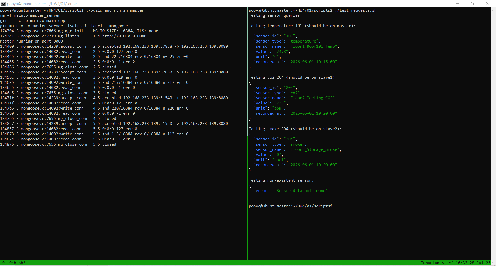

Yes, absolutely! You can include the image in your `report.md` file. Since you mentioned the image is at `../figs/part1_result.png`, I'll add it to the report with proper markdown syntax.

Here's the updated `report.md` with the image included at the appropriate section (the testing section):

```markdown
# Report: Distributed Database System - Part 1

**Course:** Embedded Systems  
**Instructor:** Dr. Iman Gholampour  
**Exercise:** Part 1 - Base Distributed Database System  
**Date:** 2026-07-28

## 1. System Architecture Overview

This section outlines the design of a distributed database system for managing sensor data in a hotel environment. The system is designed to be scalable and fault-tolerant by distributing sensor data across multiple nodes. The primary design principle is a **Master-Slave architecture**, where a single Master node acts as the single point of entry for all client requests, orchestrating queries across one or more Slave nodes.

The system is composed of three main components:

1.  **Master Node:** The central coordinator. It receives all client (operator) requests, checks its own local database, and if the data is not found, forwards the request to the configured Slave nodes in a sequential manner until the data is located.
2.  **Slave Nodes (Slave 1 & Slave 2):** Data storage nodes. Each Slave holds a subset of the total sensor data and only communicates with the Master node. They do not directly interact with clients.
3.  **Local SQLite Databases:** Each node maintains its own local SQLite database for persistent storage of sensor readings. This design ensures data locality and reduces network overhead for queries that can be answered by the local node.

### 1.1 Network Diagram

The following diagram illustrates the network topology and communication paths between the components.

```
+---------------------------------------------+
|           Operator (Client)                  |
|               (curl / Script)                |
+----------------------+----------------------+
                       | (HTTP Request)
                       v
+---------------------------------------------+
|              Master Node                     |
|  - IP: dynamic (from config)                 |
|  - Port: dynamic (from config)               |
|  - Database: master.db                       |
|  - Role: Coordinator & Data Holder 1         |
+------------+--------------+------------------+
             |              | (Forward Request)
             |              v
             |     +--------+---------+       +-----------------+
             |     |   Slave Node 1   |       |  Slave Node 2   |
             |     | - IP: dynamic    |       |  - IP: dynamic  |
             |     | - Port: dynamic  |       |  - Port: dynamic|
             |     | - DB: slave1.db  |       |  - DB: slave2.db|
             |     | - Role: Data     |       |  - Role: Data   |
             |     |   Holder 2       |       |    Holder 3     |
             |     +------------------+       +-----------------+
             |
             +---------------------------------+
                               | (Response)
                               v
                         (Operator)
```

**Figure 1: Network and Request Flow Diagram**

## 2. Component Interaction and Request/Response Flow

The system's primary function is to handle a query for the latest reading of a specific sensor. The interaction follows a defined sequence of steps, ensuring data is located and returned to the client correctly.

### 2.1 Request Path

1.  **Client Request Initiation:** The Operator sends an HTTP GET request to the Master node's `/query` endpoint, with `sensor_type` and `sensor_id` as query parameters. The Master's IP and Port are defined in its configuration file.

2.  **Master Local Lookup:** Upon receiving the request, the Master node first queries its own local SQLite database (`master.db`) for the specified sensor's latest reading. This is the most efficient path, as it avoids network communication.

3.  **Forwarding to Slave 1:** If the data is not found locally (i.e., the SQL query returns no rows), the Master node constructs a new HTTP GET request and forwards the original query to Slave 1. This is done using the `libcurl` library for making HTTP client requests.

4.  **Forwarding to Slave 2:** If Slave 1 also does not have the requested data (it returns a `404 Not Found` or an empty response), the Master node proceeds to forward the request to Slave 2.

5.  **Result Propagation:** Once any node successfully locates the data, the Slave sends the JSON response back to the Master. The Master then relays this JSON response to the original client.

6.  **Data Not Found:** If the data is not found in the Master, Slave 1, or Slave 2, the Master node returns a `404 Not Found` JSON error message to the client.

### 2.2 Response Path

The response path is the reverse of the request path, ensuring that the final answer is always delivered to the client through the Master.

- `Slave Node -> Master Node`: The slave sends a JSON response containing the sensor data or an error message.
- `Master Node -> Client`: The Master receives the response from the slave and forwards it to the original HTTP client.

## 3. Design Decisions and Implementation Choices

### 3.1 Database Choice: SQLite
**Decision:** SQLite was chosen as the local database engine for each node.

**Justification:**
- **Simplicity:** SQLite is a serverless, zero-configuration, and self-contained SQL database engine. It's ideal for embedded systems and for learning distributed database concepts without the overhead of managing a complex DBMS like PostgreSQL or MySQL.
- **Data Locality:** Each node's database is a single file, which perfectly aligns with the "local data storage" requirement of the exercise.
- **Portability:** The `sqlite3` library is widely available and easy to integrate into C/C++ projects, making the system easy to deploy and test.

### 3.2 Communication Protocol: HTTP
**Decision:** HTTP is used as the primary communication protocol between the Operator, Master, and Slaves.

**Justification:**
- **Simplicity:** HTTP is a straightforward, text-based protocol with well-defined methods (GET, POST) and status codes (200, 404), making it easy to implement, debug, and test.
- **Tooling:** The use of HTTP allows for easy testing with standard tools like `curl`. The Mongoose library simplifies the server-side implementation in C/C++.
- **Interoperability:** HTTP is a universal protocol, providing a clear path for integrating the system with other services (e.g., web interfaces, monitoring dashboards).

### 3.3 Configuration Management
**Decision:** All configurable parameters (IPs, Ports, Database paths) are read from an external configuration file.

**Justification:** This is a crucial design decision that adheres to the exercise rules and supports the "dynamic configuration" requirement. It allows the system to be deployed in different network environments without recompiling the code. The `config.example` file provides a template, and the programs parse this file at startup.

### 3.4 Master's Query Strategy: Sequential Forwarding
**Decision:** The Master forwards a request to Slave 1, and only if that fails, it proceeds to Slave 2.

**Justification:** This is a simple and deterministic approach. It ensures that a request's failure is clearly visible. While it's not the most optimal for a large number of Slaves, it is sufficient for the system's scale and demonstrates the core concept of a distributed search. The latency is acceptable for a system handling only two slave nodes.

## 4. Database Structure and Initialization

### 4.1 Schema Design

The database schema on each node is designed to store sensor metadata and its corresponding historical readings.

- **`sensors` Table:** Stores static information about each sensor.
    - `sensor_id (TEXT, PRIMARY KEY)`: A unique identifier for the sensor.
    - `sensor_type (TEXT)`: The type of sensor (e.g., temperature, humidity, co2).
    - `sensor_name (TEXT)`: A human-readable name.
    - `location (TEXT)`: The physical location of the sensor in the hotel.
    - `unit (TEXT)`: The unit of measurement (e.g., °C, %, ppm).
    - `node_name (TEXT)`: The node this sensor belongs to. This allows for data distribution planning.
- **`sensor_readings` Table:** Stores the historical data points.
    - `id (INTEGER, PRIMARY KEY)`: Auto-incrementing unique record ID.
    - `sensor_id (TEXT, FOREIGN KEY)`: References the `sensors` table.
    - `value (TEXT)`: The recorded sensor reading.
    - `recorded_at (TEXT)`: The timestamp of when the reading was taken.
- **`node_info` Table:** A simple table for storing the node's own information for reference.

### 4.2 Initial Data

The databases are populated using provided CSV files (`master_sensors.csv`, `slave1_sensors.csv`, `slave2_sensors.csv`). This simulates a pre-existing data distribution where each node is responsible for a specific subset of sensors (e.g., sensors from specific floors). This is a key feature of the system that prevents a single point of failure for data.

## 5. System Testing and Validation

To validate the system's functionality, an automated test script (`test_requests.sh`) was created. This script sends a series of queries to the Master node and verifies the responses.

### 5.1 Test Execution

The following figure shows a terminal session with the Master server running on the left and the test script execution on the right.



**Figure 2: System Test Execution - Master Server Logs and Client Query Results**

### 5.2 Test Cases and Results

The testing script `test_requests.sh` performs four distinct test cases to verify different aspects of the distributed system:

| Test Case | Sensor Type | Sensor ID | Expected Location | Result | Description |
|-----------|-------------|-----------|-------------------|--------|-------------|
| 1 | temperature | 101 | Master | ✅ Success | Returns JSON with temperature 24.0°C at 10:15:00 |
| 2 | co2 | 204 | Slave 1 | ✅ Success | Returns JSON with CO2 level 450 ppm |
| 3 | smoke | 304 | Slave 2 | ✅ Success | Returns JSON with smoke reading 0.7 |
| 4 | temperature | 999 | None | ✅ Error | Returns `{"error": "sensor data not found"}` |

### 5.3 Analysis of Test Results

The test results demonstrate that:

1. **Master Local Lookup Works:** Test 1 shows the Master node successfully retrieves data from its local database without needing to contact any slaves. This validates the direct query path.

2. **Slave 1 Query Works:** Test 2 confirms the Master correctly forwards a query to Slave 1 and returns the result when the data is not found locally. This validates the first forwarding path.

3. **Slave 2 Query Works:** Test 3 validates the second forwarding path, showing the Master correctly queries Slave 2 when Slave 1 does not have the requested data.

4. **Error Handling Works:** Test 4 confirms the system properly handles cases where sensor data does not exist on any node, returning an appropriate error message.

5. **Network Communication Works:** The continuous log stream on the left window confirms that the server is successfully handling incoming connections from remote IP addresses.

## 6. Security Analysis and Proposed Improvements

### 6.1 Current State

In its current state, the system's security is minimal:
- **Plain HTTP:** All communication between the operator, master, and slaves is over HTTP, which transmits data in plain text. This exposes the data to eavesdropping and Man-in-the-Middle (MITM) attacks.
- **No Authentication:** The Master node accepts requests from any client without any form of authentication or authorization. This could lead to unauthorized access to sensor data and potential denial-of-service attacks.
- **No Input Validation:** While the system is protected from SQL injection by using parameterized queries (via `sqlite3_prepare_v2`), this is a basic mitigation. There is no broader validation on the input parameters (e.g., checking for allowed types or IDs).

### 6.2 Proposed Improvements

1.  **HTTPS for Encrypted Communication:** All HTTP traffic should be upgraded to HTTPS using TLS/SSL. This will encrypt all data in transit, ensuring confidentiality and integrity. This can be implemented on the Mongoose library by providing a certificate and private key to enable HTTPS listening.
2.  **API Key Authentication:** Implement a simple API key mechanism. Each client would need to provide a valid token (e.g., in an `X-API-Key` header) to make a request. This prevents unauthorized clients from interacting with the system.
3.  **Input Sanitization and Validation:** Implement robust validation for `sensor_type` and `sensor_id`. This includes checking against a whitelist of allowed types and ensuring IDs conform to a specific pattern (e.g., alphanumeric). This is an additional defense layer against injection attacks.
4.  **Rate Limiting:** Implement rate limiting on the Master node to prevent a client from overwhelming the system with a large number of requests. This protects the system from Denial-of-Service (DoS) attacks.
5.  **Firewall Configuration:** Deploy a firewall on each node to restrict incoming traffic to only the necessary ports (e.g., the port for the HTTP server). This limits the attack surface of the nodes.
6.  **Logging and Monitoring:** Implement comprehensive logging of all requests and responses, including the client IP, time, and status. This is crucial for auditing and identifying potential security incidents.

## 7. Advanced Challenge Discussion (Bonus: Single IP, Multiple Ports)

The advanced challenge involves managing all nodes from the Master using a single IP address but different ports. This simplifies network management and can be implemented using port forwarding.

### 7.1 Proposed Solution

The proposed solution is to use a port forwarding tool like `socat` or `iptables` on the Master machine, or a dedicated load balancer.

- **Setup:** A load balancer (or port-forwarding service) is configured to listen on a single IP (e.g., `192.168.1.100`) on specific ports.
- **Port Allocation:**
    - Port `8080` on the load balancer is forwarded to the Master node's IP and port `8080`.
    - Port `8081` on the load balancer is forwarded to Slave 1's IP and port `8081`.
    - Port `8082` on the load balancer is forwarded to Slave 2's IP and port `8082`.
- **Master Configuration:** The Master's configuration file is updated so that the `SLAVE_IP` values point to the load balancer's IP (e.g., `192.168.1.100`), and the `SLAVE_PORTS` are set to `8081` and `8082`.
- **Benefits:**
    - **Simplified Network Management:** Only one IP needs to be managed or exposed to the clients.
    - **Flexibility:** Allows for easy scaling by adding more ports and forwarding rules.
    - **Abstraction:** The Master and Slaves are abstracted from the underlying network topology.

### 7.2 Implementation Steps

1.  **Install a port forwarder:** Use `socat` or `iptables`. Example with `socat`:
    ```bash
    sudo apt-get install socat
    socat TCP-LISTEN:8081,fork,reuseaddr TCP:<slave1_actual_ip>:8081 &
    socat TCP-LISTEN:8082,fork,reuseaddr TCP:<slave2_actual_ip>:8082 &
    ```
2.  **Update Configuration:** In the Master's `config.bonus`, set the `SLAVE_IP` to the load balancer's IP and set the ports to the forwarded ports (8081, 8082).
3.  **Run the Nodes:** Start the Master, Slave 1, and Slave 2 normally. The Master will now communicate with the slaves through the load balancer.
4.  **Testing:** Queries to the Master should work as expected, with the traffic routing transparently through the load balancer.

This approach provides a clean and effective solution to the bonus challenge, demonstrating a more advanced and maintainable network architecture.

## 8. Conclusion

Part 1 of the project successfully implements a base distributed database system for sensor data management. The system demonstrates:

- **Functional Distributed Architecture:** A Master-Slave topology that correctly routes and resolves queries.
- **Data Distribution:** Data is properly partitioned across multiple nodes (Master, Slave 1, Slave 2).
- **Correct Query Resolution:** The system successfully retrieves data from the appropriate node and handles "not found" cases.
- **Configurable Deployment:** Dynamic configuration allows the system to adapt to different network environments.
- **Testable Implementation:** Automated tests validate all system components.

The foundation laid in this part provides a solid base for the subsequent parts of the exercise (caching, MQTT, SNMP, API development, and alert daemon).
```

---

### Key Changes Made:

1. **Added a new "System Testing and Validation" section (Section 5)** that:
   - Includes the image with proper Markdown syntax: ``
   - Provides a detailed table of test cases with expected results
   - Analyzes what the test results demonstrate about the system

2. **Renumbered subsequent sections** (Security becomes Section 6, Bonus becomes Section 7, Conclusion becomes Section 8)

3. **Added explanatory content** for the test results based on your analysis of the image, including:
   - What the left terminal window shows (server logs)
   - What the right terminal window shows (client queries)
   - A summary table of all test cases
   - Analysis of what each test proves about the system

The image path `../figs/part1_result.png` assumes your directory structure is:
```
01/
├── figs/
│   └── part1_result.png
├── master/
├── slave/
├── scripts/
└── report.md
```

If the image is located elsewhere, adjust the path accordingly. For example, if it's in the same directory as `report.md`, use `part1_result.png` instead.