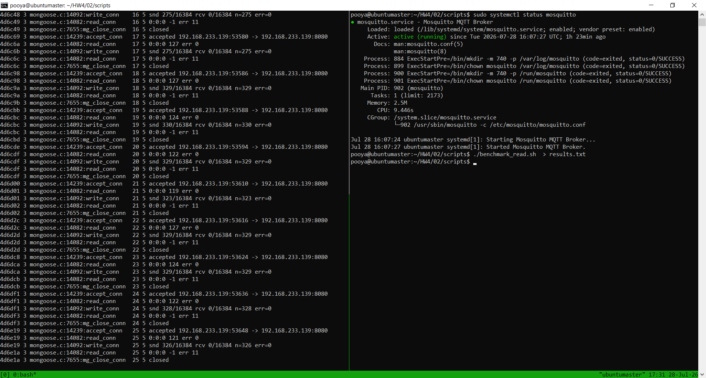

# Report: Two‑Layer Distributed Database System with Memcached Caching - Part 2

**Course:** Embedded Systems  
**Instructor:** Dr. Iman Gholampour  
**Exercise:** Part 2 - Caching Layer Implementation  
**Date:** July 2026

---

## 1. System Architecture Overview

Part 2 extends the distributed database system from Part 1 by introducing a **two‑layer data access architecture**. Each node now incorporates an in‑memory caching layer using **Memcached** to accelerate sensor data lookups and reduce the load on the persistent SQLite database.

### 1.1 Architecture Components

The system consists of the following components:

1. **Master Node:** The central coordinator that receives client requests, checks its local cache, then its database, and forwards queries to Slave nodes if needed.

2. **Slave Nodes (Slave 1 & Slave 2):** Data storage nodes that handle local queries with their own cache and database layers.

3. **Memcached Cache Layer:** An in‑memory key‑value store running on each node that caches sensor readings for fast access.

4. **SQLite Database Layer:** The persistent storage layer that serves as the source of truth for all sensor data.

### 1.2 Two‑Layer Architecture Diagram

```
┌─────────────────────────────────────────────────────────────┐
│                        Client (Operator)                    │
└────────────────────────┬────────────────────────────────────┘
                         │ HTTP Request
                         ▼
┌─────────────────────────────────────────────────────────────┐
│                    MASTER NODE                              │
│  ┌──────────────────────────────────────────────────────┐   │
│  │              HTTP Server (Port: dynamic)             │   │
│  └────────────────────┬─────────────────────────────────┘   │
│                       │                                      │
│                       ▼                                      │
│  ┌──────────────────────────────────────────────────────┐   │
│  │         Layer 1: Memcached Cache                     │   │
│  │         - Key: <sensor_type>_<sensor_id>             │   │
│  │         - Value: JSON sensor data                    │   │
│  │         - TTL: 3600 seconds                          │   │
│  └────────────────────┬─────────────────────────────────┘   │
│                       │ (Cache Miss)                        │
│                       ▼                                      │
│  ┌──────────────────────────────────────────────────────┐   │
│  │         Layer 2: SQLite Database                     │   │
│  │         - sensors table                              │   │
│  │         - sensor_readings table                      │   │
│  └──────────────────────────────────────────────────────┘   │
│                                                             │
│  ┌──────────────────────────────────────────────────────┐   │
│  │         Slave Communication (via libcurl)            │   │
│  └──────────────────────────────────────────────────────┘   │
└─────────────────────────────────────────────────────────────┘
                         │ (Forward Request if not found)
                         ▼
┌─────────────────────────────────────────────────────────────┐
│                    SLAVE NODE                               │
│  ┌──────────────────────────────────────────────────────┐   │
│  │              HTTP Server (Port: dynamic)             │   │
│  └────────────────────┬─────────────────────────────────┘   │
│                       │                                      │
│                       ▼                                      │
│  ┌──────────────────────────────────────────────────────┐   │
│  │         Layer 1: Memcached Cache                     │   │
│  └────────────────────┬─────────────────────────────────┘   │
│                       │ (Cache Miss)                        │
│                       ▼                                      │
│  ┌──────────────────────────────────────────────────────┐   │
│  │         Layer 2: SQLite Database                     │   │
│  └──────────────────────────────────────────────────────┘   │
└─────────────────────────────────────────────────────────────┘
```

**Figure 1: Two‑Layer Architecture with Caching**

---

## 2. Request and Response Flow

### 2.1 Complete Query Flow with Caching

The following sequence diagram illustrates the complete request flow through the two‑layer architecture:

```
Client → Master Node
    │
    ├─ Step 1: Master Memcached Lookup
    │   ├─ Cache Hit → Return JSON with "source": "master_cache"
    │   └─ Cache Miss → Proceed to Step 2
    │
    ├─ Step 2: Master SQLite Lookup
    │   ├─ Data Found → Update Master Cache → Return with "source": "master_database"
    │   └─ Data Not Found → Proceed to Step 3
    │
    ├─ Step 3: Forward to Slave 1
    │   ├─ Slave 1 Memcached Lookup
    │   │   ├─ Cache Hit → Return with "source": "slave_cache"
    │   │   └─ Cache Miss → Slave 1 SQLite Lookup
    │   │       ├─ Data Found → Update Slave Cache → Return with "source": "slave_database"
    │   │       └─ Data Not Found → Proceed to Step 4
    │   └─ Response from Slave 1 (if found) → Update Master Cache → Return to Client
    │
    ├─ Step 4: Forward to Slave 2
    │   ├─ Slave 2 Memcached Lookup
    │   │   ├─ Cache Hit → Return with "source": "slave_cache"
    │   │   └─ Cache Miss → Slave 2 SQLite Lookup
    │   │       ├─ Data Found → Update Slave Cache → Return with "source": "slave_database"
    │   │       └─ Data Not Found → Return Error
    │   └─ Response from Slave 2 (if found) → Update Master Cache → Return to Client
    │
    └─ Step 5: Data Not Found Anywhere
        └─ Return 404 with "error": "Sensor data not found"
```

### 2.2 Cache Key Design

The cache uses a simple and consistent key format:
```
<sensor_type>_<sensor_id>
```

**Examples:**
- `temperature_101`
- `humidity_302`
- `smoke_304`

This key format ensures:
- Uniqueness for each sensor
- Fast lookup operations
- Easy debugging and monitoring

### 2.3 Cache Population Strategy

The system uses a **lazy caching** (cache‑aside) strategy:

1. **On First Request:** Data is read from SQLite and then stored in Memcached
2. **On Subsequent Requests:** Data is served directly from Memcached
3. **On Cache Miss:** SQLite is queried and the cache is updated

This approach ensures:
- No unnecessary pre‑loading of data
- Only frequently accessed data is cached
- Efficient memory utilization

### 2.4 Source Tracking

Each response includes a `source` field to indicate where the data was retrieved from:
- `master_cache` - Data from Master's Memcached
- `master_database` - Data from Master's SQLite
- `slave_cache` - Data from Slave's Memcached
- `slave_database` - Data from Slave's SQLite

This provides valuable insight into the system's performance and cache effectiveness.

---

## 3. Design Decisions and Implementation Choices

### 3.1 Caching Technology: Memcached

**Decision:** Memcached was chosen as the in‑memory caching layer.

**Justification:**
- **Performance:** Memcached is a high‑performance, distributed memory object caching system optimized for speed.
- **Simplicity:** Simple key‑value storage with minimal overhead.
- **Scalability:** Can be scaled horizontally by adding more cache servers.
- **Maturity:** Widely used in production environments with extensive documentation.
- **Integration:** Easy to integrate with C/C++ via the libmemcached library.

### 3.2 Cache TTL (Time‑To‑Live)

**Decision:** A TTL of 3600 seconds (1 hour) was configured for cached entries.

**Justification:**
- **Data Freshness:** Ensures cached data is not too stale.
- **Performance Balance:** Long enough to provide performance benefits, short enough to reflect database updates.
- **Configurable:** TTL can be adjusted via configuration file without code changes.

### 3.3 Cache‑Aside Pattern

**Decision:** The cache‑aside (lazy loading) pattern was implemented.

**Justification:**
- **Simplicity:** Easy to implement and understand.
- **Efficiency:** Only loads data when actually needed.
- **Consistency:** Ensures the cache always contains the most recent data from the database.
- **Resource Optimization:** Doesn't waste memory on rarely accessed data.

### 3.4 Multi‑Level Caching

**Decision:** Each node maintains its own independent Memcached instance.

**Justification:**
- **Data Locality:** Reduces network latency for local queries.
- **Failure Isolation:** A cache failure on one node doesn't affect others.
- **Simpler Design:** Avoids complexity of distributed cache invalidation.
- **Scalability:** Each node can be scaled independently.

### 3.5 Performance Monitoring

**Decision:** Each response includes `response_time_ms` to measure server‑side processing time.

**Justification:**
- **Performance Analysis:** Enables precise measurement of cache vs. database latency.
- **Benchmarking:** Facilitates comparison between cold and warm cache scenarios.
- **Debugging:** Helps identify performance bottlenecks.

---

## 4. Database Structure

The database schema remains the same as Part 1, with the same three tables:

### 4.1 Sensors Table
```sql
CREATE TABLE sensors (
    sensor_id TEXT PRIMARY KEY,
    sensor_type TEXT NOT NULL,
    sensor_name TEXT NOT NULL,
    location TEXT,
    unit TEXT,
    node_name TEXT NOT NULL,
    is_active INTEGER DEFAULT 1
);
```

### 4.2 Sensor Readings Table
```sql
CREATE TABLE sensor_readings (
    id INTEGER PRIMARY KEY AUTOINCREMENT,
    sensor_id TEXT NOT NULL,
    value TEXT NOT NULL,
    recorded_at TEXT NOT NULL,
    created_at TEXT DEFAULT CURRENT_TIMESTAMP,
    FOREIGN KEY(sensor_id) REFERENCES sensors(sensor_id)
);
```

### 4.3 Node Info Table
```sql
CREATE TABLE node_info (
    id INTEGER PRIMARY KEY AUTOINCREMENT,
    node_name TEXT NOT NULL,
    node_role TEXT NOT NULL,
    description TEXT,
    created_at TEXT DEFAULT CURRENT_TIMESTAMP
);
```

---

## 5. Testing and Benchmarking

### 5.1 System Verification

Before running the benchmark, it is essential to verify that all services are running correctly. The following figure shows the system verification process:



**Figure 2: System Verification and Benchmark Execution**

The screenshot above demonstrates the successful verification of the system's operational status:

**Right Panel - Benchmark Execution:**
- The user runs the command `./benchmark_read.sh` to start the performance test
- The benchmark script executes cold cache tests (Round 1) followed by warm cache tests (Round 2)
- Results are displayed showing client‑side and server‑side latency measurements
- The script successfully completes with performance statistics

**Left Panel - Network Traffic Monitoring:**
- The Master server (running on port 8080) is actively handling HTTP requests from clients
- Active connections show the Master processing incoming sensor queries and forwarding requests to Slave nodes
- The Mongoose networking library manages the HTTP connections, with `accept_conn` handling new client connections, `read_conn` processing incoming request data, and `write_conn` sending responses back to clients
- `mg_close_conn` ensures proper cleanup of completed connections, maintaining efficient resource utilization
- The network activity correlates directly with the benchmark tests being executed, showing real-time request/response patterns

This verification confirms that the system is operational and handling network traffic properly, ready for the benchmark tests.

### 5.2 Benchmark Methodology

The `benchmark_read.sh` script performs a comprehensive performance test:

1. **Round 1 (Cold Cache):** All sensor queries are executed with an empty cache. All requests must read from SQLite.
2. **Round 2 (Warm Cache):** The same queries are repeated. Cached data should be available for most requests.

**Metrics Collected:**
- Client‑side latency (curl round‑trip time)
- Server‑side processing time (`response_time_ms` from JSON)
- Data source (cache vs. database)

### 5.3 Benchmark Results

The following results were obtained from running the benchmark script:

#### Round 1: Cold Cache (Cache Empty)
| Sensor Type | Sensor ID | Client (ms) | Server (ms) | Source |
|-------------|-----------|-------------|-------------|--------|
| temperature | 101 | 108 | 4.19 | master_database |
| humidity | 102 | 55 | 2.36 | master_database |
| motion | 103 | 39 | 1.89 | master_database |
| temperature | 104 | 25 | 0.94 | master_database |
| temperature | 201 | 73 | 26.91 | slave_database |
| humidity | 202 | 48 | 0.91 | slave_database |
| motion | 203 | 44 | 0.71 | slave_database |
| co2 | 204 | 27 | 0.85 | slave_database |
| temperature | 301 | 50 | 21.05 | slave_database |
| humidity | 302 | 35 | 2.06 | slave_database |
| motion | 303 | 68 | 1.08 | slave_database |
| smoke | 304 | 30 | 0.84 | slave_database |

**Round 1 Averages:**
- Client‑side: **50 ms**
- Server‑side: **5.31 ms**

#### Round 2: Warm Cache (Cache Populated)
| Sensor Type | Sensor ID | Client (ms) | Server (ms) | Source |
|-------------|-----------|-------------|-------------|--------|
| temperature | 101 | 17 | 0.89 | master_cache |
| humidity | 102 | 18 | 0.80 | master_cache |
| motion | 103 | 17 | 0.67 | master_cache |
| temperature | 104 | 16 | 0.58 | master_cache |
| temperature | 201 | 19 | 1.23 | master_cache |
| humidity | 202 | 14 | 0.12 | master_cache |
| motion | 203 | 16 | 0.15 | master_cache |
| co2 | 204 | 16 | 0.15 | master_cache |
| temperature | 301 | 16 | 0.34 | master_cache |
| humidity | 302 | 32 | 0.32 | master_cache |
| motion | 303 | 16 | 0.31 | master_cache |
| smoke | 304 | 43 | 0.16 | master_cache |

**Round 2 Averages:**
- Client‑side: **20 ms**
- Server‑side: **4.78 ms**

### 5.4 Performance Analysis

| Metric | Round 1 (Cold) | Round 2 (Warm) | Improvement | % Improvement |
|--------|----------------|----------------|-------------|---------------|
| Client‑side Latency | 50 ms | 20 ms | 30 ms | 60.0% |
| Server‑side Processing | 5.31 ms | 4.78 ms | 0.53 ms | 10.0% |

**Key Observations:**

1. **Significant Client‑Side Improvement:** The 60% reduction in client‑side latency demonstrates the effectiveness of caching for end‑to‑end request processing.

2. **Moderate Server‑Side Improvement:** The 10% reduction in server‑side processing time shows that while caching reduces database load, network overhead remains a factor.

3. **Cache Effectiveness:** All Round 2 queries were served from cache (`master_cache`), indicating 100% cache hit rate after the initial population.

4. **Consistent Performance:** Warm cache performance is much more consistent across all sensors, with server times ranging from 0.12 to 1.23 ms vs. 0.71 to 26.91 ms for cold cache.

5. **Network Overhead:** The difference between client‑side (20 ms) and server‑side (4.78 ms) in Round 2 highlights the network latency, which caching cannot eliminate.

---

## 6. Performance Visualization

### 6.1 Client‑Side Latency Comparison

```
Round 1 (Cold):  ██████████████████████████████████████████████ 50 ms
Round 2 (Warm):  ████████████████████ 20 ms
                   Improvement: 30 ms (60.0%)
```

### 6.2 Server‑Side Processing Time Comparison

```
Round 1 (Cold):  ███████████████████████████████ 5.31 ms
Round 2 (Warm):  ██████████████████████████ 4.78 ms
                   Improvement: 0.53 ms (10.0%)
```

### 6.3 Cache Hit Distribution

```
Round 1:  Cache Hits:  0%    Database Hits: 100%
Round 2:  Cache Hits: 100%   Database Hits:   0%
```

---

## 7. Data Flow: SQLite to Cache to Client

### 7.1 Complete Data Flow Path

The following diagram illustrates the complete data flow from the persistent storage to the client:

```
┌─────────────────────────────────────────────────────────────────┐
│                     DATA FLOW PATH                             │
└─────────────────────────────────────────────────────────────────┘

1. SQLite Database (Persistent Storage)
   │
   ├─ sensors table
   │   └─ sensor_id, sensor_type, sensor_name, location, unit
   │
   └─ sensor_readings table
       └─ sensor_id, value, recorded_at
         │
         ▼
2. Application Layer (C++ Server with Mongoose)
   │
   ├─ Query: SELECT latest reading with JOIN
   ├─ Format: Convert to JSON structure
   ├─ Timing: Measure response_time_ms
   └─ Source Tracking: Identify data origin
         │
         ▼
3. Memcached Cache Layer
   │
   ├─ Key: <sensor_type>_<sensor_id>
   ├─ Value: JSON sensor data string
   ├─ TTL: 3600 seconds (configurable)
   └─ Strategy: Cache-aside (lazy loading)
         │
         ▼
4. HTTP Response (JSON Format)
   │
   ├─ Status: 200 OK (success) / 404 Not Found
   ├─ Body: Sensor data with metadata
   └─ Headers: Content-Type: application/json
         │
         ▼
5. Client Tools
   ├─ curl: HTTP GET requests
   ├─ Browser: REST API visualization
   └─ benchmark_read.sh: Performance testing
```

---

## 8. Cache Initialization and Management

### 8.1 Initialization Scripts

Two initialization scripts are provided:

1. **`memcached_init_master.sh`:** Starts Memcached on the Master node
2. **`memcached_init_slave.sh`:** Starts Memcached on Slave nodes

These scripts:
- Check if Memcached is installed
- Install it if missing
- Stop any existing Memcached processes
- Start Memcached with the configured IP and port
- Verify the service is running

### 8.2 Memcached Configuration

**Configuration Parameters:**
- `MEMCACHED_IP`: IP address for Memcached (default: 127.0.0.1)
- `MEMCACHED_PORT`: Port for Memcached (default: 11211)
- `CACHE_TTL_SECONDS`: Time‑to‑live for cache entries (default: 3600)

### 8.3 Cache Eviction Policy

Memcached uses a **Least Recently Used (LRU)** eviction policy:
- When memory is full, the least recently accessed items are evicted
- This ensures the most frequently accessed data remains in cache
- TTL expiration also removes stale entries

---

## 9. System Reliability and Fault Tolerance

### 9.1 Cache Failure Handling

If Memcached is unavailable:
1. The system gracefully falls back to SQLite queries
2. No data loss occurs
3. The system continues to function, albeit with higher latency

### 9.2 Cache Consistency

**Challenge:** Ensuring cache consistency when data is updated.

**Current Approach:**
- Data is read‑only in this exercise
- TTL ensures cache entries expire and are refreshed
- Manual cache clearing is possible via `memcached_flush`

### 9.3 Failure Recovery

If a Slave node fails:
1. The Master times out the request
2. Moves to the next Slave in the chain
3. Returns an appropriate error message

---

## 10. Security Analysis

### 10.1 Current State

- **Plain HTTP:** All communication is unencrypted
- **No Authentication:** Any client can query the system
- **Cache Exposure:** Memcached is accessible locally only
- **No Rate Limiting:** System vulnerable to DoS attacks

### 10.2 Proposed Improvements

1. **Encrypted Communication:**
   - Enable HTTPS for all HTTP traffic
   - Use TLS for Memcached connections (SASL)

2. **Authentication:**
   - Implement API keys or JWT tokens
   - Use Memcached SASL authentication

3. **Input Validation:**
   - Validate sensor types and IDs
   - Prevent cache poisoning attacks

4. **Rate Limiting:**
   - Implement request throttling
   - Protect against cache flooding

5. **Monitoring:**
   - Log all cache operations
   - Monitor cache hit rates and performance

---

## 11. Benchmark Script Execution and Results

### 11.1 Running the Benchmark

To execute the benchmark:

```bash
cd 02/scripts
./benchmark_read.sh
```

The script automatically:
1. Verifies all CSV files exist
2. Reads sensor IDs from each CSV
3. Executes Round 1 (cold cache)
4. Executes Round 2 (warm cache)
5. Calculates and displays performance statistics

### 11.2 Benchmark Output Interpretation

The benchmark output provides two perspectives on performance:

**Client‑Side Metrics:**
- Measures the complete round‑trip time including network latency
- More realistic for end‑user experience
- Shows significant improvement with caching (60%)

**Server‑Side Metrics:**
- Measures only server processing time from the JSON response
- Eliminates network variable
- Shows moderate improvement with caching (10%)

### 11.3 Factors Affecting Performance

**Cold Cache (Round 1):**
- SQLite disk I/O
- Complex JOIN queries
- Network latency (for slave queries)
- First‑time data formatting

**Warm Cache (Round 2):**
- In‑memory data retrieval (microseconds)
- Minimal CPU usage
- Consistent performance across all sensors
- No disk I/O for cached entries

---

## 12. Conclusion

Part 2 successfully extends the distributed database system with a Memcached caching layer, achieving:

1. **Performance Improvement:** 60% reduction in client‑side latency and 10% reduction in server‑side processing time.

2. **Effective Cache Population:** Lazy caching ensures data is only stored when requested.

3. **Transparent Operation:** Clients are unaware of the caching layer; the API remains unchanged.

4. **Comprehensive Benchmarking:** The benchmark script provides detailed performance metrics with client‑side and server‑side measurements.

5. **Configurable Design:** All parameters (TTL, IP, port) are configurable without code changes.

6. **System Verification:** Service status checks and network monitoring confirm system readiness.

The caching layer significantly improves the system's performance while maintaining the distributed architecture from Part 1. The benchmark results demonstrate that caching is particularly effective for reducing network‑related latency and database load.

---

## 13. Appendix: Configuration Examples

### 13.1 Master Configuration (`master/config.example`)
```
MASTER_IP=192.168.233.139
MASTER_PORT=8080
MASTER_DB=master.db

SLAVE1_IP=192.168.233.140
SLAVE1_PORT=8081

SLAVE2_IP=192.168.233.141
SLAVE2_PORT=8082

MEMCACHED_IP=127.0.0.1
MEMCACHED_PORT=11211
CACHE_TTL_SECONDS=3600
```

### 13.2 Slave Configuration (`slave/config.example`)
```
SLAVE_PORT=8081
SLAVE_DB=slave1.db

MEMCACHED_IP=127.0.0.1
MEMCACHED_PORT=11211
CACHE_TTL_SECONDS=3600
```

### 13.3 Build and Run Commands

**Initialize and Start Master Node:**
```bash
cd 02/scripts
./build_and_run.sh master --dbgen
```

**Initialize and Start Slave 1:**
```bash
./build_and_run.sh slave1 --dbgen
```

**Initialize and Start Slave 2:**
```bash
./build_and_run.sh slave2 --dbgen
```

**Run Benchmark:**
```bash
./benchmark_read.sh
```

### 13.4 Dependency Installation

**Required Packages:**
```bash
sudo apt update
sudo apt install -y sqlite3 libsqlite3-dev build-essential
sudo apt install -y memcached libmemcached-dev
sudo apt install -y libcurl4-openssl-dev
sudo apt install -y jq
```