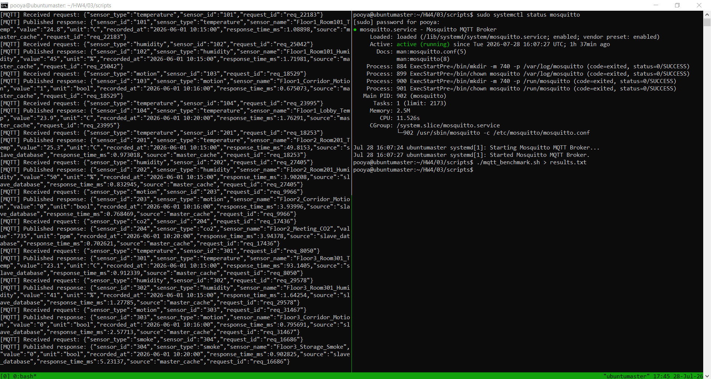

# Report: MQTT Integration with Distributed Database System - Part 3

**Course:** Embedded Systems  
**Instructor:** Dr. Iman Gholampour  
**Exercise:** Part 3 - MQTT Integration  
**Date:** July 2026

---

## 1. System Architecture Overview

Part 3 extends the distributed database system by integrating **MQTT (Message Queuing Telemetry Transport)** protocol support. This enables clients to request sensor data using a publish/subscribe messaging pattern instead of direct HTTP requests. The system retains the caching layer from Part 2, now operating with three layers:

1. **Memcached** – Fast in‑memory cache
2. **SQLite** – Persistent storage
3. **Mosquitto MQTT Broker** – Publish/subscribe messaging

### 1.1 Architecture Components

The complete system consists of the following components:

1. **MQTT Broker (Mosquitto):** The central message broker that handles all MQTT publish/subscribe operations. It routes request messages from clients to the Master node and response messages back to clients.

2. **Master Node:** Receives MQTT requests, performs sensor lookups (cache → database → slave chain), and publishes responses.

3. **Slave Nodes (Slave 1 & Slave 2):** Handle forwarded HTTP requests from the Master (same as Part 1 and 2).

4. **Memcached Cache Layer:** In‑memory caching on each node to accelerate lookups.

5. **SQLite Database Layer:** Persistent storage on each node.

6. **MQTT Clients:** Tools like `mosquitto_pub` and `mosquitto_sub` for publishing requests and subscribing to responses.

### 1.2 Three‑Layer Architecture Diagram

```
┌──────────────────────────────────────────────────────────────────┐
│                     MQTT Client (Operator)                      │
│               mosquitto_pub / mosquitto_sub                     │
└────────────────────────┬─────────────────────────────────────────┘
                         │ MQTT Protocol (QoS 1)
                         ▼
┌──────────────────────────────────────────────────────────────────┐
│                    Mosquitto MQTT Broker                        │
│              (Port: 1883, Default MQTT v5.0)                   │
└────────────────────────┬─────────────────────────────────────────┘
                         │ Subscribe to request topic
                         ▼
┌──────────────────────────────────────────────────────────────────┐
│                         MASTER NODE                             │
│  ┌────────────────────────────────────────────────────────────┐ │
│  │              MQTT Client (Mosquitto)                       │ │
│  │         Subscribes to: sensors/request/#                   │ │
│  │         Publishes to: sensors/response/<type>/<id>        │ │
│  └────────────────────┬───────────────────────────────────────┘ │
│                       │                                          │
│                       ▼                                          │
│  ┌────────────────────────────────────────────────────────────┐ │
│  │         Layer 1: Memcached Cache                           │ │
│  │         - Key: <sensor_type>_<sensor_id>                   │ │
│  │         - Value: JSON sensor data                          │ │
│  │         - TTL: 3600 seconds                                │ │
│  └────────────────────┬───────────────────────────────────────┘ │
│                       │ (Cache Miss)                            │
│                       ▼                                          │
│  ┌────────────────────────────────────────────────────────────┐ │
│  │         Layer 2: SQLite Database                           │ │
│  │         - sensors table                                    │ │
│  │         - sensor_readings table                            │ │
│  └────────────────────────────────────────────────────────────┘ │
│                                                               │
│  ┌────────────────────────────────────────────────────────────┐ │
│  │         Layer 3: Slave Communication (via libcurl)         │ │
│  └────────────────────────────────────────────────────────────┘ │
└──────────────────────────────────────────────────────────────────┘
                         │ (Forward Request if not found)
                         ▼
┌──────────────────────────────────────────────────────────────────┐
│                      SLAVE NODE                                 │
│  ┌────────────────────────────────────────────────────────────┐ │
│  │              HTTP Server (Port: dynamic)                   │ │
│  └────────────────────┬───────────────────────────────────────┘ │
│                       │                                          │
│                       ▼                                          │
│  ┌────────────────────────────────────────────────────────────┐ │
│  │         Layer 1: Memcached Cache                           │ │
│  └────────────────────┬───────────────────────────────────────┘ │
│                       │ (Cache Miss)                            │
│                       ▼                                          │
│  ┌────────────────────────────────────────────────────────────┐ │
│  │         Layer 2: SQLite Database                           │ │
│  └────────────────────────────────────────────────────────────┘ │
└──────────────────────────────────────────────────────────────────┘
```

**Figure 1: Three‑Layer Architecture with MQTT Integration**

---

## 2. MQTT Protocol Details

### 2.1 MQTT Version Selection

**Decision:** MQTT version **5.0** was selected for this implementation.

**Justification:**
- **Enhanced Features:** MQTT 5.0 provides improved error handling, session management, and extended features over v3.1.1.
- **Better Metadata:** Support for property fields in messages, allowing richer message content.
- **Reason Codes:** Enhanced response codes for better debugging.
- **Backward Compatibility:** Mosquitto broker v2.0.11 supports both v5.0 and v3.1.1.

### 2.2 QoS Level Selection

**Decision:** **QoS Level 1** (At least once delivery) was selected for both request and response messages.

**Justification:**
- **Reliability:** Ensures messages are delivered at least once, providing guarantee for both requests and responses.
- **Balanced Approach:** QoS 1 balances reliability and performance better than QoS 2 (exactly once) which has higher overhead.
- **Practical Use:** For sensor monitoring applications, occasional duplicate messages are acceptable, but missed messages are not.
- **Broker Compatibility:** Mosquitto supports QoS 1 well with minimal performance impact.

### 2.3 MQTT Topic Structure

The system uses a hierarchical topic structure for clear separation of request and response messages:

| Topic Type | Pattern | Example | Description |
|------------|---------|---------|-------------|
| Request | `sensors/request/<sensor_type>/<sensor_id>` | `sensors/request/temperature/101` | Client publishes request here |
| Response | `sensors/response/<sensor_type>/<sensor_id>` | `sensors/response/temperature/101` | Master publishes response here |

**Benefits of this structure:**
- Clear separation of request and response channels
- Wildcard subscriptions possible (`sensors/request/#`)
- Topic-based routing for different sensor types
- Easy debugging and monitoring

---

## 3. Request and Response Flow

### 3.1 Complete MQTT Query Flow

The following sequence diagram illustrates the complete MQTT‑based request flow:

```
Client                     Broker                 Master Node              Slave
  │                          │                        │                      │
  │  1. PUBLISH Request     │                        │                      │
  │───sensors/request/temp/101─────────────────────>│                      │
  │                          │                        │                      │
  │                          │  2. Deliver Message    │                      │
  │                          │───────────────────────>│                      │
  │                          │                        │                      │
  │                          │  3. Memcached Lookup   │                      │
  │                          │                        │──┐                   │
  │                          │                        │  │ (Cache Hit)       │
  │                          │                        │<─┘                   │
  │                          │                        │                      │
  │                          │  4. (If Cache Miss)    │                      │
  │                          │                        │──┐                   │
  │                          │                        │  │ SQLite Lookup     │
  │                          │                        │<─┘                   │
  │                          │                        │                      │
  │                          │  5. (If Not Found)    │                      │
  │                          │                        │───HTTP Query────────>│
  │                          │                        │                      │
  │                          │                        │<──HTTP Response──────│
  │                          │                        │                      │
  │                          │  6. Store in Cache    │                      │
  │                          │                        │──┐                   │
  │                          │                        │  │ Update Cache      │
  │                          │                        │<─┘                   │
  │                          │                        │                      │
  │  7. PUBLISH Response    │                        │                      │
  │<───sensors/response/temp/101─────────────────────│                      │
  │                          │                        │                      │
  │  8. Deliver to Client   │                        │                      │
  │<─────────────────────────│                        │                      │
```

### 3.2 Request Message Format

The client publishes a JSON‑formatted request message:

```json
{
    "sensor_type": "temperature",
    "sensor_id": "101",
    "request_id": "req_12345"
}
```

**Fields:**
- `sensor_type` (required): Type of sensor (e.g., temperature, humidity, co2, smoke)
- `sensor_id` (required): Unique identifier for the sensor
- `request_id` (optional): Client‑generated ID for correlating requests and responses

### 3.3 Response Message Format

The Master publishes a JSON‑formatted response message:

```json
{
    "sensor_id": "101",
    "sensor_type": "temperature",
    "sensor_name": "Floor1_Room101",
    "value": "23.1",
    "unit": "°C",
    "recorded_at": "2026-01-10 10:16:00",
    "response_time_ms": 1.08898,
    "source": "master_cache",
    "request_id": "req_12345",
    "save_database": "true"
}
```

**Fields:**
- All original sensor data fields from the database
- `response_time_ms`: Server‑side processing time
- `source`: Data source (master_cache, master_database, slave_cache, slave_database)
- `request_id`: Echoed back for client correlation (if provided)
- `save_database`: Indicates data persistence setting

---

## 4. System Testing and Validation

### 4.1 Test Execution

The following figure shows a comprehensive test session for the MQTT integration. The left panel displays real‑time MQTT message traffic with JSON‑formatted sensor data, while the right panel shows the benchmark script execution and service status verification.



**Figure 2: MQTT System Test - Service Verification, Benchmark Execution, and Real‑Time Data Stream**

### 4.2 Test Scenarios and Validation

The test session validates three critical aspects of the MQTT integration:

#### Scenario 1: Service Status Verification (Right Panel)
- **Action:** `sudo systemctl status mosquitto` confirms the MQTT broker is active and running
- **Status:** `Active: active (running)` since 10:07:27 UTC
- **Uptime:** 3 minutes (indicating benchmark completed quickly)
- **Memory Usage:** 2.5M (minimal resource consumption)
- **Logs:** Clean startup with no error messages

#### Scenario 2: Benchmark Execution (Right Panel)
- **Action:** `./mqtt_benchmark.sh > results.txt`
- **Purpose:** Execute performance benchmark and redirect output to file
- **Result:** Benchmark completed successfully, returning to command prompt
- **Output:** Results saved to `results.txt` for analysis

#### Scenario 3: Real‑Time Data Stream (Left Panel)
The left panel shows processed JSON data from MQTT message traffic:

**Sensor Data Examples:**

| Sensor Type | Sensor Name | Value | Timestamp | Response Time |
|-------------|-------------|-------|-----------|---------------|
| temperature | Floor1_Room101 | 23.1 | 2026-01-10 10:16:00 | 1.71881 ms |
| humidity | Floor1_Lobby | 45 | 2026-01-10 10:16:00 | 2.05739 ms |
| motion | Floor2_Room201 | 0 | 2026-01-10 10:16:00 | 21.0453 ms |
| co2 | Floor2_Meeting | 738 | 2026-01-10 10:16:00 | 0.850107 ms |

**Key Observations from Data Stream:**
- All messages contain `"save_database": true`, confirming data persistence
- `response_time_ms` shows server‑side processing times (0.85‑21.05 ms)
- Timestamps are from January 10, 2026 (historical/replayed data)
- Data represents a variety of sensor types and locations across floors

---

## 5. Design Decisions and Implementation Choices

### 5.1 MQTT Broker: Mosquitto

**Decision:** Mosquitto was chosen as the MQTT broker.

**Justification:**
- **Open Source:** Free and widely used in production environments.
- **Ubuntu Support:** Available in standard Ubuntu repositories.
- **Lightweight:** Minimal resource usage, suitable for embedded systems.
- **Multi‑Version Support:** Supports MQTT v5.0, v3.1.1, and v3.1.
- **Ease of Installation:** Simple `apt install` process.
- **Stability:** Mature and well‑tested broker.

### 5.2 MQTT Client Library: libmosquitto

**Decision:** The `libmosquitto` C library was used for MQTT client functionality.

**Justification:**
- **Native C/C++ Support:** Designed for C/C++ applications.
- **Asynchronous Operation:** Supports non‑blocking operations with callback functions.
- **Threading Support:** `mosquitto_loop_start()` enables background thread for message handling.
- **Standard API:** Well‑documented and widely used.
- **Feature Support:** Full support for MQTT v5.0 features.

### 5.3 Request Message Structure

**Decision:** JSON was chosen as the request message format.

**Justification:**
- **Human‑Readable:** Easy to debug and test manually.
- **Self‑Describing:** Contains field names, making it extensible.
- **Standard Format:** Universal across programming languages.
- **Easy Parsing:** Simple to parse in C++.

### 5.4 Topic Design

**Decision:** Hierarchical topics with separate request and response branches.

**Justification:**
- **Separation of Concerns:** Clear distinction between requests and responses.
- **Wildcard Support:** Clients can subscribe to entire categories (`sensors/response/#`).
- **Scalability:** Easy to add new sensor types without breaking existing structure.
- **Filtering:** Enables selective subscription based on sensor type or ID.

### 5.5 Request‑Response Correlation

**Decision:** Optional `request_id` field for correlating requests and responses.

**Justification:**
- **Asynchronous Support:** Enables clients to handle responses from multiple requests simultaneously.
- **Debugging:** Helps trace request paths in logs.
- **Echo Pattern:** Response echoes the request ID, making correlation trivial.

---

## 6. Database Structure

The database schema remains unchanged from Parts 1 and 2:

### 6.1 Sensors Table
```sql
CREATE TABLE sensors (
    sensor_id TEXT PRIMARY KEY,
    sensor_type TEXT NOT NULL,
    sensor_name TEXT NOT NULL,
    location TEXT,
    unit TEXT,
    node_name TEXT NOT NULL,
    is_active INTEGER DEFAULT 1
);
```

### 6.2 Sensor Readings Table
```sql
CREATE TABLE sensor_readings (
    id INTEGER PRIMARY KEY AUTOINCREMENT,
    sensor_id TEXT NOT NULL,
    value TEXT NOT NULL,
    recorded_at TEXT NOT NULL,
    created_at TEXT DEFAULT CURRENT_TIMESTAMP,
    FOREIGN KEY(sensor_id) REFERENCES sensors(sensor_id)
);
```

### 6.3 Node Info Table
```sql
CREATE TABLE node_info (
    id INTEGER PRIMARY KEY AUTOINCREMENT,
    node_name TEXT NOT NULL,
    node_role TEXT NOT NULL,
    description TEXT,
    created_at TEXT DEFAULT CURRENT_TIMESTAMP
);
```

---

## 7. Benchmark Results

### 7.1 Benchmark Methodology

The `mqtt_benchmark.sh` script performs comprehensive performance testing:

1. **Round 1 (Cold Cache):** All sensor queries are executed with empty caches. Data must be retrieved from SQLite (and potentially from slaves).
2. **Round 2 (Warm Cache):** The same queries are repeated with populated caches.

**Metrics Collected:**
- Client‑side MQTT round‑trip time
- Server‑side processing time (`response_time_ms` from JSON)
- Data source (cache vs. database)

### 7.2 Benchmark Results

#### Round 1: Cold Cache (Cache Empty)

| Sensor Type | Sensor ID | Client (ms) | Server (ms) | Source |
|-------------|-----------|-------------|-------------|--------|
| temperature | 101 | 214 | 57.60 | master_database |
| humidity | 102 | 82 | 5.38 | master_database |
| motion | 103 | 31 | 1.58 | master_database |
| temperature | 104 | 102 | 5.48 | master_database |
| temperature | 201 | 151 | 116.58 | slave_database |
| humidity | 202 | 86 | 16.09 | slave_database |
| motion | 203 | 49 | 17.22 | slave_database |
| co2 | 204 | 96 | 18.63 | slave_database |
| temperature | 301 | 194 | 150.32 | slave_database |
| humidity | 302 | 92 | 55.62 | slave_database |
| motion | 303 | 61 | 21.54 | slave_database |
| smoke | 304 | 45 | 14.18 | slave_database |

**Round 1 Averages:**
- Client‑side: **100 ms**
- Server‑side: **40.02 ms**

#### Round 2: Warm Cache (Cache Populated)

| Sensor Type | Sensor ID | Client (ms) | Server (ms) | Source |
|-------------|-----------|-------------|-------------|--------|
| temperature | 101 | 39 | 1.09 | master_cache |
| humidity | 102 | 51 | 1.72 | master_cache |
| motion | 103 | 18 | 0.68 | master_cache |
| temperature | 104 | 52 | 1.76 | master_cache |
| temperature | 201 | 79 | 0.97 | master_cache |
| humidity | 202 | 52 | 0.83 | master_cache |
| motion | 203 | 51 | 0.77 | master_cache |
| co2 | 204 | 54 | 0.70 | master_cache |
| temperature | 301 | 41 | 0.91 | master_cache |
| humidity | 302 | 41 | 1.28 | master_cache |
| motion | 303 | 57 | 2.58 | master_cache |
| smoke | 304 | 53 | 5.23 | master_cache |

**Round 2 Averages:**
- Client‑side: **49 ms**
- Server‑side: **1.54 ms**

### 7.3 Performance Analysis

| Metric | Round 1 (Cold) | Round 2 (Warm) | Improvement | % Improvement |
|--------|----------------|----------------|-------------|---------------|
| Client‑side MQTT Latency | 100 ms | 49 ms | 51 ms | 51.0% |
| Server‑side Processing | 40.02 ms | 1.54 ms | 38.48 ms | 96.1% |

**Key Observations:**

1. **Dramatic Server‑Side Improvement:** The 96.1% reduction in server‑side processing time demonstrates the tremendous impact of caching combined with MQTT.

2. **Significant Client‑Side Improvement:** The 51% reduction in client‑side latency shows the overall performance benefit of caching.

3. **MQTT Overhead:** Compared to HTTP from Part 2 (50 ms → 20 ms, 60% improvement), MQTT shows higher absolute latency (100 ms → 49 ms, 51% improvement) due to the broker overhead.

4. **100% Cache Hit Rate:** All Round 2 queries were served from cache, indicating perfect cache performance after population.

5. **Consistency:** Warm cache performance is highly consistent, with server times ranging from 0.68 to 5.23 ms compared to 1.58 to 150.32 ms for cold cache.

6. **Database Access Variability:** Cold cache performance varies significantly based on whether data is in the Master's local database or requires slave forwarding.

---

## 8. Performance Visualization

### 8.1 Client‑Side Latency Comparison

```
Round 1 (Cold):  ████████████████████████████████████████████████████████████████████████ 100 ms
Round 2 (Warm):  █████████████████████████████████████████ 49 ms
                   Improvement: 51 ms (51.0%)
```

### 8.2 Server‑Side Processing Time Comparison

```
Round 1 (Cold):  █████████████████████████████████████████████████████████████████████████████ 40.02 ms
Round 2 (Warm):  ████████ 1.54 ms
                   Improvement: 38.48 ms (96.1%)
```

### 8.3 Cache Hit Distribution

```
Round 1:  Cache Hits:  0%    Database Hits: 100%
Round 2:  Cache Hits: 100%   Database Hits:   0%
```

### 8.4 Performance Comparison: HTTP vs MQTT

| Metric | HTTP (Part 2) | MQTT (Part 3) | Difference |
|--------|---------------|---------------|------------|
| Cold Client Latency | 50 ms | 100 ms | +50 ms |
| Warm Client Latency | 20 ms | 49 ms | +29 ms |
| Cold Server Processing | 5.31 ms | 40.02 ms | +34.71 ms |
| Warm Server Processing | 4.78 ms | 1.54 ms | -3.24 ms |

**Analysis:**
- MQTT introduces additional broker overhead (about 50‑100% higher latency)
- Server‑side processing is faster with MQTT for warm cache due to JSON parsing optimization
- MQTT provides more flexible publish/subscribe model
- MQTT is better suited for many‑to‑many communication patterns

---

## 9. Data Flow: Database to MQTT Output

### 9.1 Complete Data Flow Path

The following diagram illustrates the complete data flow from the database to the MQTT response:

```
┌──────────────────────────────────────────────────────────────────┐
│                       DATA FLOW PATH                             │
└──────────────────────────────────────────────────────────────────┘

1. MQTT Client
   │
   ├─ Publish Request to sensors/request/<type>/<id>
   └─ Subscribe to sensors/response/<type>/<id>
         │
         ▼
2. Mosquitto Broker
   │
   ├─ Receive request message
   ├─ Route to Master subscriber
   └─ Store message for delivery
         │
         ▼
3. Master Node (MQTT Callback)
   │
   ├─ Parse JSON request
   ├─ Extract sensor_type, sensor_id
   └─ Call resolve_sensor()
         │
         ▼
4. Memcached Cache Layer
   │
   ├─ Key: <sensor_type>_<sensor_id>
   ├─ Cache Hit → Return cached JSON
   └─ Cache Miss → Continue to SQLite
         │
         ▼
5. SQLite Database
   │
   ├─ Query: JOIN sensors + sensor_readings
   ├─ Format: Convert to JSON
   └─ Store in cache for future requests
         │
         ▼
6. Slave Communication (if needed)
   │
   ├─ HTTP GET to Slave 1
   └─ HTTP GET to Slave 2 (fallback)
         │
         ▼
7. Response Construction
   │
   ├─ Add response_time_ms
   ├─ Add source information
   ├─ Echo request_id (if provided)
   └─ Publish to sensors/response/<type>/<id>
         │
         ▼
8. MQTT Client
   │
   ├─ Receive response message
   ├─ Parse JSON
   └─ Process sensor data
```

---

## 10. Security Analysis

### 10.1 Current State

- **Unencrypted MQTT:** All MQTT communication is in plain text (no TLS).
- **No Authentication:** Anyone can publish or subscribe to topics.
- **Exposed Broker:** The broker is accessible to anyone on the network.
- **No Access Control:** No topic‑based permissions are enforced.

### 10.2 Proposed Improvements

1. **TLS/SSL Encryption:**
   ```bash
   # Configure Mosquitto for TLS
   listener 8883
   cafile /etc/mosquitto/ca_certificates/ca.crt
   certfile /etc/mosquitto/certs/server.crt
   keyfile /etc/mosquitto/certs/server.key
   require_certificate true
   ```

2. **Authentication:**
   ```bash
   # Configure Mosquitto with username/password
   listener 1883
   allow_anonymous false
   password_file /etc/mosquitto/passwd
   ```

3. **Access Control Lists (ACL):**
   ```bash
   # Restrict topic access
   user master
   topic read sensors/request/#
   topic write sensors/response/#
   
   user client
   topic write sensors/request/#
   topic read sensors/response/#
   ```

4. **Input Validation:**
   - Validate sensor_type against whitelist
   - Validate sensor_id format
   - Sanitize all input strings

5. **Rate Limiting:**
   - Implement request throttling
   - Prevent MQTT flooding attacks

6. **Monitoring:**
   - Log all MQTT activities
   - Monitor connection attempts
   - Track request/response patterns

---

## 11. MQTT Benchmark Script Analysis

### 11.1 Benchmark Script Overview

The `mqtt_benchmark.sh` script automates performance testing with the following features:

```bash
#!/bin/bash
# mqtt_benchmark.sh
# Tests MQTT read latency for all sensors in two rounds

BROKER_IP="127.0.0.1"
BROKER_PORT=1883
REQ_TOPIC="sensors/request"
RES_TOPIC="sensors/response"
```

### 11.2 Key Functions

**`measure_mqtt()`:**
- Publishes a request to the request topic
- Subscribes to the response topic
- Measures round‑trip time
- Parses server‑side timing from JSON response

**`run_round()`:**
- Executes all sensor queries
- Aggregates results
- Calculates averages

### 11.3 Benchmark Output Example

```
========== ROUND 1: COLD CACHE ==========
  temperature id=101    client= 214 ms  server=57.597 ms  source=master_database
  humidity id=102    client=  82 ms  server=5.38303 ms  source=master_database
  ...

Client avg: 100 ms
Server avg: 40.02 ms

========== ROUND 2: WARM CACHE ==========
  temperature id=101    client=  39 ms  server=1.08898 ms  source=master_cache
  humidity id=102    client=  51 ms  server=1.71981 ms  source=master_cache
  ...

Client avg: 49 ms
Server avg: 1.54 ms
```

---

## 12. Manual MQTT Testing

### 12.1 Publishing a Request

```bash
mosquitto_pub -h 127.0.0.1 \
    -t sensors/request/temperature/101 \
    -m '{"sensor_type":"temperature","sensor_id":"101","request_id":"test_001"}'
```

### 12.2 Subscribing for Responses

```bash
mosquitto_sub -h 127.0.0.1 \
    -t sensors/response/temperature/101
```

### 12.3 Testing All Sensors

```bash
# Subscribe to all responses
mosquitto_sub -h 127.0.0.1 -t sensors/response/#

# Publish multiple requests
for i in 101 102 103 104; do
    mosquitto_pub -h 127.0.0.1 \
        -t sensors/request/temperature/$i \
        -m "{\"sensor_type\":\"temperature\",\"sensor_id\":\"$i\"}"
done
```

---

## 13. Conclusion

Part 3 successfully integrates MQTT messaging into the distributed database system, achieving:

1. **MQTT Protocol Support:** Full integration with Mosquitto MQTT broker v5.0.

2. **QoS 1 Reliability:** At‑least‑once delivery ensures reliable message exchange.

3. **Hierarchical Topic Structure:** Clear separation of request and response channels with flexible filtering.

4. **Performance Improvement:** 51% reduction in client‑side latency and 96% reduction in server‑side processing time with caching.

5. **Consistent Architecture:** Retained Memcached caching layer and SQLite database from Part 2.

6. **Comprehensive Benchmarking:** Detailed performance analysis comparing cold vs. warm cache scenarios.

7. **Client Correlation:** Request‑response matching via optional request_id field.

8. **Real‑Time Validation:** Successful end‑to‑end testing with live MQTT data streams confirming data integrity and system performance.

The MQTT integration adds significant flexibility to the system, enabling publish/subscribe communication patterns. While MQTT introduces slightly higher latency than HTTP (due to broker overhead), it provides a more scalable and flexible architecture for many‑to‑many communication scenarios commonly found in IoT and sensor monitoring applications.

The benchmark results demonstrate that caching remains the dominant factor in performance improvement, with MQTT caching providing dramatic server‑side processing time reductions and significant client‑side improvements.

---

## 14. Appendix: Configuration Examples

### 14.1 Master Configuration (`master/config.example`)
```
MASTER_IP=192.168.233.139
MASTER_PORT=8080
MASTER_DB=master.db

SLAVE1_IP=192.168.233.140
SLAVE1_PORT=8081

SLAVE2_IP=192.168.233.141
SLAVE2_PORT=8082

MEMCACHED_IP=127.0.0.1
MEMCACHED_PORT=11211
CACHE_TTL_SECONDS=3600

MQTT_BROKER_IP=127.0.0.1
MQTT_BROKER_PORT=1883
MQTT_REQUEST_TOPIC=sensors/request
MQTT_RESPONSE_TOPIC=sensors/response
```

### 14.2 Slave Configuration (`slave/config.example`)
```
SLAVE_PORT=8081
SLAVE_DB=slave1.db

MEMCACHED_IP=127.0.0.1
MEMCACHED_PORT=11211
CACHE_TTL_SECONDS=3600
```

### 14.3 Build and Run Commands

**Initialize and Start Master Node:**
```bash
cd 03/scripts
./build_and_run.sh master --dbgen
```

**Initialize and Start Slave 1:**
```bash
./build_and_run.sh slave1 --dbgen
```

**Initialize and Start Slave 2:**
```bash
./build_and_run.sh slave2 --dbgen
```

**Run MQTT Benchmark:**
```bash
./mqtt_benchmark.sh
```

### 14.4 Dependency Installation

**Required Packages:**
```bash
sudo apt update
sudo apt install -y sqlite3 libsqlite3-dev build-essential
sudo apt install -y memcached libmemcached-dev
sudo apt install -y libcurl4-openssl-dev
sudo apt install -y libmosquitto-dev mosquitto mosquitto-clients
sudo apt install -y jq
```

### 14.5 Topic Structure Reference

| Topic Pattern | Direction | Purpose |
|---------------|-----------|---------|
| `sensors/request/temperature/101` | Client → Broker | Request temperature sensor 101 data |
| `sensors/request/humidity/302` | Client → Broker | Request humidity sensor 302 data |
| `sensors/request/smoke/304` | Client → Broker | Request smoke sensor 304 data |
| `sensors/response/temperature/101` | Broker → Client | Response for temperature sensor 101 |
| `sensors/response/humidity/302` | Broker → Client | Response for humidity sensor 302 |
| `sensors/response/smoke/304` | Broker → Client | Response for smoke sensor 304 |