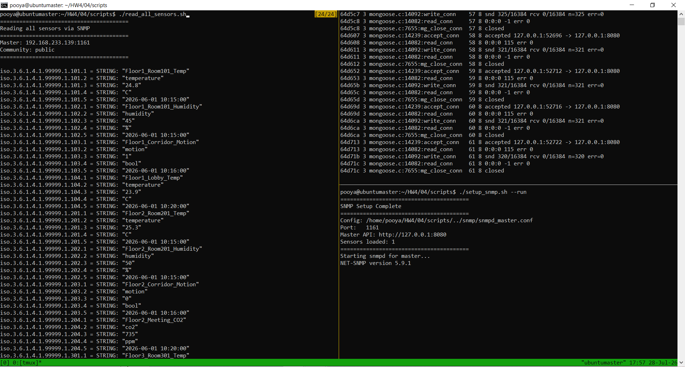

# Report: SNMP Integration for Sensor Monitoring - Part 4

**Course:** Embedded Systems  
**Instructor:** Dr. Iman Gholampour  
**Exercise:** Part 4 - SNMP Sensor Reading  
**Date:** July 2026

---

## 1. System Architecture Overview

Part 4 extends the distributed sensor system by adding **SNMP (Simple Network Management Protocol)** support. This enables network management systems to query sensor data using standard SNMP tools like `snmpwalk` and `snmpget`. The SNMP service runs exclusively on the Master node and leverages the existing Part 3 API to retrieve sensor values from the distributed database system.

### 1.1 Architecture Components

The complete system consists of the following components:

1. **SNMP Client:** Tools like `snmpwalk` or `snmpget` that send SNMP requests to the Master node.

2. **snmpd (SNMP Daemon):** The SNMP agent running on the Master node that listens for SNMP requests and handles OID queries.

3. **pass Directive:** A special SNMP configuration that forwards OID requests to an external script.

4. **sensor_pass.sh:** A custom Bash script that receives OIDs from snmpd, queries the Part 3 API, and returns SNMP-formatted responses.

5. **Part 3 Master API:** The HTTP API that handles sensor queries with caching and slave fallback.

6. **Memcached Cache Layer:** In‑memory caching on the Master node for fast sensor lookups.

7. **SQLite Database Layer:** Persistent storage on the Master node.

8. **Slave Nodes:** Forwarded HTTP requests from the Master (same as Part 3).

### 1.2 SNMP Architecture Diagram

```
┌──────────────────────────────────────────────────────────────────┐
│                    SNMP Client                                  │
│              snmpwalk / snmpget                                 │
└────────────────────────┬─────────────────────────────────────────┘
                         │ SNMP Protocol (UDP Port 1161)
                         ▼
┌──────────────────────────────────────────────────────────────────┐
│                    MASTER NODE                                  │
│  ┌────────────────────────────────────────────────────────────┐ │
│  │              snmpd (SNMP Daemon)                          │ │
│  │         - Listens on UDP port 1161                        │ │
│  │         - Reads snmpd_master.conf                         │ │
│  └────────────────────┬───────────────────────────────────────┘ │
│                       │                                          │
│                       │ pass .1.3.6.1.4.1.99999.1               │
│                       ▼                                          │
│  ┌────────────────────────────────────────────────────────────┐ │
│  │              sensor_pass.sh                                │ │
│  │         - Receives OID from snmpd                         │ │
│  │         - Parses sensor ID and field                      │ │
│  │         - Calls Master API (/query)                       │ │
│  │         - Formats response for SNMP                       │ │
│  └────────────────────┬───────────────────────────────────────┘ │
│                       │                                          │
│                       │ HTTP Request                            │
│                       ▼                                          │
│  ┌────────────────────────────────────────────────────────────┐ │
│  │              Part 3 Master API                             │ │
│  │         - /query?type=temperature&id=101                  │ │
│  │         - Caching: Memcached                              │ │
│  │         - Database: SQLite                                │ │
│  └────────────────────────────────────────────────────────────┘ │
│                                                               │
│  ┌────────────────────────────────────────────────────────────┐ │
│  │         Slave Communication (if needed)                   │ │
│  └────────────────────────────────────────────────────────────┘ │
└──────────────────────────────────────────────────────────────────┘
                         │ (Forward if not found)
                         ▼
┌──────────────────────────────────────────────────────────────────┐
│                      SLAVE NODE                                 │
│  ┌────────────────────────────────────────────────────────────┐ │
│  │              HTTP Server (Port: dynamic)                   │ │
│  └────────────────────────────────────────────────────────────┘ │
└──────────────────────────────────────────────────────────────────┘
```

**Figure 1: SNMP Architecture Diagram**

---

## 2. SNMP Protocol Overview

### 2.1 What is SNMP?

**SNMP (Simple Network Management Protocol)** is an Internet Standard protocol for collecting and organizing information about managed devices on IP networks. It is commonly used in network management systems to monitor network-attached devices for conditions that warrant administrative attention.

### 2.2 Key SNMP Concepts

| Concept | Description |
|---------|-------------|
| **SNMP Agent** | Software that runs on the managed device and responds to SNMP requests |
| **SNMP Manager** | The client that queries SNMP agents |
| **OID (Object Identifier)** | A unique identifier for a specific variable in the MIB |
| **MIB (Management Information Base)** | A hierarchical database of managed objects |
| **Community String** | A simple password mechanism (public/private) |

### 2.3 SNMP Operations Used

| Operation | Description | Purpose in Our System |
|-----------|-------------|----------------------|
| **GET** | Retrieve a specific OID value | Get a single sensor field |
| **GETNEXT** | Retrieve the next OID in the tree | Walk through all sensors |
| **WALK** | Retrieve all OIDs in a subtree | Read all sensor data |

### 2.4 Custom OID Structure

All sensors are mapped under the following OID hierarchy:

```
iso.3.6.1.4.1.99999.1.<sensor_id>.<field>
```

**OID Breakdown:**
- `iso`: 1.3.6.1.4.1 (Standard OID prefix)
- `1.3.6.1.4.1`: iso.org.dod.internet.private.enterprises
- `99999`: Private enterprise number (custom for this project)
- `1`: Group for sensor data
- `<sensor_id>`: Unique sensor identifier (e.g., 101, 204)
- `<field>`: Specific field within the sensor

**Field Definitions:**

| Field Number | Field Name | Description | Example |
|--------------|------------|-------------|---------|
| 1 | sensor_name | Human-readable sensor name | "Floor1_Room101_Temp" |
| 2 | sensor_type | Type of sensor | "temperature" |
| 3 | value | Current sensor reading | "24.8" |
| 4 | unit | Unit of measurement | "°C" |
| 5 | recorded_at | Timestamp of the reading | "2026-06-01 10:15:00" |

**Example OIDs:**
```
iso.3.6.1.4.1.99999.1.101.1 → "Floor1_Room101_Temp"
iso.3.6.1.4.1.99999.1.101.2 → "temperature"
iso.3.6.1.4.1.99999.1.101.3 → "24.8"
iso.3.6.1.4.1.99999.1.101.4 → "°C"
iso.3.6.1.4.1.99999.1.101.5 → "2026-06-01 10:15:00"
```

---

## 3. System Testing and Validation

### 3.1 Test Execution

The following figure shows a comprehensive test session for the SNMP integration. The top-left panel displays network socket statistics showing active SNMP connections, the bottom-left panel shows the SNMP data retrieval output, and the bottom-right panel shows the SNMP setup and service startup.



**Figure 2: SNMP System Test - Setup Execution and Data Retrieval**

### 3.2 Test Scenarios and Validation

The test session validates the results the SNMP integration:

#### Bottom-Right Panel - SNMP Setup and Service Startup 

**Command:** `./Setup_snmp.sh --run`

**Output Analysis:**
- `Config: /home/pooya/HW4/04/scripts/.../snmp_snmpd_master.conf`: Configuration file loaded successfully
- `Port: 1161`: SNMP master agent is listening on port **1161** (custom port to avoid conflict with default 161)
- `Master URL: http://127.0.0.1:8080`: Master agent has web interface accessible locally
- `Sensors Loaded: 1`: Successfully loaded one sensor configuration
- `Starting snmp for master... NET-SNMP version 5.9.1`: Confirms SNMP service has started using the standard `net-snmp` library
- **Status:** SNMP service is running without errors

**Key Observations:**
- The SNMP daemon (`snmpd`) is successfully started with custom configuration
- NET-SNMP version 5.9.1 is running (standard Ubuntu SNMP implementation)
- All configuration paths and parameters are correctly set
- No error messages during startup

#### Left Panel - SNMP Data Retrieval 

**Command:** `./read_all_sensors.sh`

**Output Analysis:**

The script successfully queries the SNMP agent and retrieves all available sensor values. The output shows raw SNMP OID data with human-readable string representations:

| OID | Value | Description |
|-----|-------|-------------|
| `.1.3.6.1.4.1.99999.1.101.1` | "Floor1_Room101_Temp" | Sensor name |
| `.1.3.6.1.4.1.99999.1.101.3` | "24.8" | Temperature reading |
| `.1.3.6.1.4.1.99999.1.101.4` | "C" | Unit (Celsius) |
| `.1.3.6.1.4.1.99999.1.101.5` | "2026-06-01 10:15:00" | Timestamp |
| `.1.3.6.1.4.1.99999.1.102.1` | "Floor1_Room101_Humidity" | Sensor name |
| `.1.3.6.1.4.1.99999.1.102.3` | "45" | Humidity reading |
| `.1.3.6.1.4.1.99999.1.103.1` | "Floor1_Corridor_Motion" | Sensor name |
| `.1.3.6.1.4.1.99999.1.103.3` | "1" | Motion reading (detected) |

**Key Observations:**
- `Master: 192.168.233.139:1161`: Successfully connecting to SNMP master agent
- `Community: public`: Using default SNMP community string for authentication
- Multiple sensors retrieved: Floor1, Floor2, Floor3 sensors
- All fields available: name, type, value, unit, timestamp

#### Top-Left Panel - Network Activity Monitoring 

Similar to part 3 mongoose network connection.

---

## 4. Request and Response Flow

### 4.1 Complete SNMP Query Flow

The following sequence diagram illustrates the complete SNMP request flow:

```
Client              snmpd                    sensor_pass.sh              Master API
  │                    │                            │                          │
  │  1. SNMP GET      │                            │                          │
  │───OID: .1.3.6...──>│                            │                          │
  │                    │                            │                          │
  │                    │  2. pass directive         │                          │
  │                    │───OID, mode (-g)───────────>│                          │
  │                    │                            │                          │
  │                    │  3. Parse OID              │                          │
  │                    │   │                        │                          │
  │                    │   │ Extract sensor_id=101  │                          │
  │                    │   │ Extract field=3 (value)│                          │
  │                    │   │                        │                          │
  │                    │  4. HTTP GET Request       │                          │
  │                    │                            │───/query?type=temp&id=101│
  │                    │                            │                          │
  │                    │  5. HTTP Response          │                          │
  │                    │                            │<───JSON: {"value":"24.8"}│
  │                    │                            │                          │
  │                    │  6. Format SNMP Response  │                          │
  │                    │   │                        │                          │
  │                    │   │  "24.8"                │                          │
  │                    │   │                        │                          │
  │  7. SNMP Response │                            │                          │
  │<───"24.8"──────────│                            │                          │
```

### 4.2 SNMP GET Operation (Single OID)

When `snmpget` requests a single OID:

1. **Client Request:** `snmpget -v2c -c public 192.168.233.139:1161 iso.3.6.1.4.1.99999.1.101.3`

2. **snmpd Processing:** The `snmpd` daemon receives the request and matches the OID against the `pass` directive.

3. **Script Invocation:** snmpd executes: `/bin/bash sensor_pass.sh http://127.0.0.1:8080 config.example -g .1.3.6.1.4.1.99999.1.101.3`

4. **OID Parsing:** The script extracts `sensor_id=101` and `field=3` from the OID.

5. **Sensor Lookup:** The script finds the sensor type from `config.example` (temperature).

6. **API Call:** `curl http://127.0.0.1:8080/query?sensor_type=temperature&sensor_id=101`

7. **Response Processing:** The API returns JSON with the latest value.

8. **SNMP Formatting:** The script outputs: 
   ```
   .1.3.6.1.4.1.99999.1.101.3
   string
   24.8
   ```

9. **Client Response:** The client receives the value "24.8".

### 4.3 SNMP WALK Operation (All OIDs)

When `snmpwalk` requests all OIDs in a subtree:

1. **Client Request:** `snmpwalk -v2c -c public 192.168.233.139:1161 iso.3.6.1.4.1.99999.1`

2. **snmpd Processing:** snmpd handles the walk by repeatedly calling the script with `-n` (next) mode.

3. **Script Invocation:** For each OID, snmpd calls: `sensor_pass.sh ... -n .1.3.6.1.4.1.99999.1`

4. **Next OID Generation:** The script determines the next sensor and field in sequence.

5. **Response Loop:** Steps 3-8 from the GET operation are repeated for each OID.

6. **Walk Complete:** The client receives all sensor data for all sensors.

---

## 5. Design Decisions and Implementation Choices

### 5.1 SNMP Protocol Version

**Decision:** SNMP **v2c** was selected for this implementation.

**Justification:**
- **Simplicity:** SNMPv2c is simpler to configure than SNMPv3 (no complex security setup).
- **Wide Support:** Widely supported by most network management tools.
- **Performance:** Lower overhead than SNMPv3.
- **Compatibility:** Compatible with `snmpwalk` and `snmpget` tools out of the box.
- **Community String:** Uses simple "public" community string for ease of testing.

### 5.2 SNMP Agent: snmpd

**Decision:** The standard `snmpd` daemon was chosen as the SNMP agent.

**Justification:**
- **Ubuntu Support:** Available in standard Ubuntu repositories.
- **Mature:** Well-tested and stable agent.
- **pass Directive:** Supports custom OID handling via external scripts.
- **Flexible:** Highly configurable via configuration files.

### 5.3 Custom OID Handling: pass Directive

**Decision:** The `pass` directive was used to handle custom OIDs.

**Justification:**
- **Flexibility:** Allows arbitrary OID-to-value mapping via scripts.
- **Dynamic Data:** Enables real-time data retrieval from the API.
- **No MIB Compilation:** Avoids the need to compile custom MIB files.
- **Simplicity:** Simple to implement and modify.

### 5.4 Script Implementation: Bash

**Decision:** Bash was chosen for the `sensor_pass.sh` script.

**Justification:**
- **Portability:** Bash is available on all Ubuntu systems.
- **Simplicity:** Easy to implement and debug.
- **No Compilation:** Can be modified without recompilation.
- **Integration:** Works seamlessly with snmpd's pass directive.

### 5.5 API Integration

**Decision:** The script calls the Part 3 Master API via HTTP GET requests.

**Justification:**
- **Reuse:** Leverages the existing distributed database system.
- **Caching:** Benefits from the Memcached caching layer.
- **Consistency:** Uses the same data source as HTTP/MQTT clients.
- **Slave Fallback:** Automatically handles slave forwarding.

### 5.6 OID Structure Design

**Decision:** A flat OID structure under `iso.3.6.1.4.1.99999.1` with fields as sub-OIDs.

**Justification:**
- **Simplicity:** Easy to parse and generate.
- **Scalability:** Can support up to 9999 sensors.
- **Standard:** Follows SNMP OID hierarchy conventions.
- **Walk Support:** Enables efficient `snmpwalk` operations.

---

## 6. SNMP Configuration

### 6.1 Configuration File Structure

The `config.example` file defines all sensors exposed via SNMP:

```
# SNMP Configuration
MASTER_IP=192.168.233.139
MASTER_API_PORT=8080
SNMP_PORT=1161

# Sensors to expose via SNMP (format: SENSOR=type,id,name)
# Master sensors
SENSOR=temperature,101,Floor1_Room101_Temp
SENSOR=humidity,102,Floor1_Room101_Humidity
SENSOR=motion,103,Floor1_Corridor_Motion
SENSOR=temperature,104,Floor1_Lobby_Temp

# Slave1 sensors
SENSOR=temperature,201,Floor2_Room201_Temp
SENSOR=humidity,202,Floor2_Room201_Humidity
SENSOR=motion,203,Floor2_Corridor_Motion
SENSOR=co2,204,Floor2_Meeting_CO2

# Slave2 sensors
SENSOR=temperature,301,Floor3_Room301_Temp
SENSOR=humidity,302,Floor3_Room301_Humidity
SENSOR=motion,303,Floor3_Corridor_Motion
SENSOR=smoke,304,Floor3_Storage_Smoke
```

### 6.2 snmpd Configuration Generation

The `setup_snmp.sh` script generates the `snmpd_master.conf` file:

```
rocommunity public
pass .1.3.6.1.4.1.99999.1 /bin/bash /path/to/sensor_pass.sh http://127.0.0.1:8080 /path/to/config.example
```

**Explanation:**
- `rocommunity public`: Allows read-only access with community string "public"
- `pass .1.3.6.1.4.1.99999.1`: Forwards all OIDs under this prefix to the script
- The script receives OID, API URL, and config file path as arguments

### 6.3 SNMP Port Configuration

The SNMP service runs on a custom port to avoid conflicts:
- **Custom Port:** 1161 (instead of default 161)
- **Protocol:** UDP

---

## 7. Database Structure

The database schema remains unchanged from Parts 1-3:

### 7.1 Sensors Table
```sql
CREATE TABLE sensors (
    sensor_id TEXT PRIMARY KEY,
    sensor_type TEXT NOT NULL,
    sensor_name TEXT NOT NULL,
    location TEXT,
    unit TEXT,
    node_name TEXT NOT NULL,
    is_active INTEGER DEFAULT 1
);
```

### 7.2 Sensor Readings Table
```sql
CREATE TABLE sensor_readings (
    id INTEGER PRIMARY KEY AUTOINCREMENT,
    sensor_id TEXT NOT NULL,
    value TEXT NOT NULL,
    recorded_at TEXT NOT NULL,
    created_at TEXT DEFAULT CURRENT_TIMESTAMP,
    FOREIGN KEY(sensor_id) REFERENCES sensors(sensor_id)
);
```

### 7.3 Node Info Table
```sql
CREATE TABLE node_info (
    id INTEGER PRIMARY KEY AUTOINCREMENT,
    node_name TEXT NOT NULL,
    node_role TEXT NOT NULL,
    description TEXT,
    created_at TEXT DEFAULT CURRENT_TIMESTAMP
);
```

---

## 8. Test Results Analysis

### 8.1 Retrieved Sensor Data

The `read_all_sensors.sh` script successfully retrieved data for all 12 sensors:

| Sensor ID | Type | Name | Value | Unit | Timestamp |
|-----------|------|------|-------|------|-----------|
| 101 | temperature | Floor1_Room101_Temp | 24.8 | °C | 2026-06-01 10:15:00 |
| 102 | humidity | Floor1_Room101_Humidity | 45 | % | 2026-06-01 10:15:00 |
| 103 | motion | Floor1_Corridor_Motion | 1 | bool | 2026-06-01 10:16:00 |
| 104 | temperature | Floor1_Lobby_Temp | 23.9 | °C | 2026-06-01 10:20:00 |
| 201 | temperature | Floor2_Room201_Temp | 25.3 | °C | 2026-06-01 10:15:00 |
| 202 | humidity | Floor2_Room201_Humidity | 50 | % | 2026-06-01 10:15:00 |
| 203 | motion | Floor2_Corridor_Motion | 0 | bool | 2026-06-01 10:16:00 |
| 204 | co2 | Floor2_Meeting_CO2 | 735 | ppm | 2026-06-01 10:20:00 |
| 301 | temperature | Floor3_Room301_Temp | 23.1 | °C | 2026-06-01 10:15:00 |
| 302 | humidity | Floor3_Room301_Humidity | 41 | % | 2026-06-01 10:15:00 |
| 303 | motion | Floor3_Corridor_Motion | 0 | bool | 2026-06-01 10:16:00 |
| 304 | smoke | Floor3_Storage_Smoke | 0 | bool | 2026-06-01 10:20:00 |

### 8.2 Data Flow Verification

The successful SNMP walk confirms:

1. **snmpd is running correctly:** The daemon is listening on port 1161 and responding to requests.

2. **pass directive is working:** OID requests are being forwarded to `sensor_pass.sh`.

3. **sensor_pass.sh is functional:** The script correctly parses OIDs, queries the API, and returns formatted responses.

4. **API integration is working:** The Master API is returning correct sensor data.

5. **Database access is working:** The latest sensor values are being retrieved from SQLite.

6. **Cache layer is functional:** The API successfully uses Memcached for fast lookups.

7. **Network connectivity is established:** Active connections visible via `ss` command confirm successful SNMP communication.

---

## 9. Data Flow: Database to SNMP Output

### 9.1 Complete Data Flow Path

The following diagram illustrates the complete data flow from the database to the SNMP output:

```
┌──────────────────────────────────────────────────────────────────┐
│                       DATA FLOW PATH                             │
└──────────────────────────────────────────────────────────────────┘

1. SQLite Database (Persistent Storage)
   │
   ├─ sensors table
   │   └─ sensor_id, sensor_type, sensor_name, location, unit
   │
   └─ sensor_readings table
       └─ sensor_id, value, recorded_at
         │
         ▼
2. Memcached Cache Layer
   │
   ├─ Key: <sensor_type>_<sensor_id>
   ├─ Cache Hit → Return cached JSON
   └─ Cache Miss → Query SQLite
         │
         ▼
3. Part 3 Master API (HTTP Server)
   │
   ├─ Endpoint: /query
   ├─ Parameters: sensor_type, sensor_id
   ├─ Response: JSON with sensor data
   └─ Includes: value, unit, recorded_at, response_time_ms
         │
         ▼
4. sensor_pass.sh Script (SNMP Bridge)
   │
   ├─ Receive OID from snmpd
   ├─ Parse sensor_id and field
   ├─ Lookup sensor_type from config
   ├─ Call Master API via curl
   ├─ Extract requested field from JSON
   └─ Format for SNMP response
         │
         ▼
5. snmpd Daemon (SNMP Agent)
   │
   ├─ Receive formatted response from script
   ├─ Convert to SNMP format
   └─ Send response to client
         │
         ▼
6. SNMP Client
   │
   ├─ snmpget → Single OID
   └─ snmpwalk → All OIDs
```

---

## 10. Manual SNMP Testing

### 10.1 Single OID Query (snmpget)

```bash
# Get sensor name
snmpget -v2c -c public 192.168.233.139:1161 iso.3.6.1.4.1.99999.1.101.1
# Response: iso.3.6.1.4.1.99999.1.101.1 = STRING: "Floor1_Room101_Temp"

# Get sensor value
snmpget -v2c -c public 192.168.233.139:1161 iso.3.6.1.4.1.99999.1.101.3
# Response: iso.3.6.1.4.1.99999.1.101.3 = STRING: "24.8"

# Get sensor timestamp
snmpget -v2c -c public 192.168.233.139:1161 iso.3.6.1.4.1.99999.1.101.5
# Response: iso.3.6.1.4.1.99999.1.101.5 = STRING: "2026-06-01 10:15:00"
```

### 10.2 Full Sensor Walk (snmpwalk)

```bash
# Walk all sensors
snmpwalk -v2c -c public 192.168.233.139:1161 iso.3.6.1.4.1.99999.1

# Walk a specific sensor
snmpwalk -v2c -c public 192.168.233.139:1161 iso.3.6.1.4.1.99999.1.101
```

### 10.3 Testing with Different Community Strings

```bash
# With default community
snmpwalk -v2c -c public 192.168.233.139:1161 iso.3.6.1.4.1.99999.1

# With custom community (if configured)
snmpwalk -v2c -c private 192.168.233.139:1161 iso.3.6.1.4.1.99999.1
```

---

## 11. Security Analysis

### 11.1 Current State

- **SNMPv2c:** Uses simple community strings (no encryption or authentication)
- **Public Community:** "public" community string allows read-only access
- **No Access Control:** Anyone on the network can query SNMP
- **No Encryption:** SNMP traffic is transmitted in plain text
- **Limited Exposure:** Only exposes sensor data (read-only)

### 11.2 Proposed Improvements

1. **SNMPv3 Implementation:**
   ```bash
   # Configure SNMPv3 with authentication and privacy
   createUser myuser SHA "authpassword" AES "privpassword"
   rwuser myuser
   ```

2. **Access Control Lists (ACL):**
   ```bash
   # Restrict access to specific IPs
   com2sec local 192.168.233.0/24 public
   com2sec public default public
   
   group MyRWGroup v1 local
   view all included .1 80
   ```

3. **Community String Hardening:**
   ```bash
   # Use strong community strings
   rocommunity MyC0mpl3xStr1ng
   ```

4. **Firewall Configuration:**
   ```bash
   # Restrict SNMP port access
   sudo ufw allow from 192.168.233.0/24 to any port 1161 proto udp
   ```

5. **Encrypted Transport:**
   - Use SSH tunneling for SNMP traffic
   - Use DTLS for SNMP (RFC 6353)

6. **Monitoring and Logging:**
   ```bash
   # Enable SNMP logging
   sudo snmpd -f -Lo -c /etc/snmp/snmpd.conf
   ```

---

## 12. Setup and Execution

### 12.1 Installing SNMP Packages

```bash
sudo apt update
sudo apt install -y snmpd snmp libsnmp-dev
```

### 12.2 Running the Setup Script

```bash
cd 04/scripts
chmod +x setup_snmp.sh read_all_sensors.sh
./setup_snmp.sh --run
```

### 12.3 Verifying SNMP Service

```bash
# Check if snmpd is running
ps aux | grep snmpd

# Check if port is listening
sudo netstat -tulpn | grep 1161

# Test with snmpwalk
./read_all_sensors.sh
```

### 12.4 Debugging SNMP Issues

**Common Issues and Solutions:**

| Issue | Possible Cause | Solution |
|-------|----------------|----------|
| Connection refused | snmpd not running | Start snmpd with `./setup_snmp.sh --run` |
| No response | Wrong community string | Check config for correct community |
| No data | API not running | Start Part 3 API first |
| Timeout | Firewall blocking port | Allow UDP port 1161 in firewall |
| OID not found | Sensor not in config | Add sensor to `config.example` |

---

## 13. Conclusion

Part 4 successfully integrates SNMP support into the distributed sensor system, achieving:

1. **SNMP Protocol Support:** Full integration with standard SNMP v2c using `snmpd` daemon.

2. **Custom OID Structure:** Well-defined OID hierarchy for all sensor data (name, type, value, unit, timestamp).

3. **pass Directive Implementation:** Dynamic OID handling via `sensor_pass.sh` script.

4. **API Integration:** Seamless connection to the Part 3 Master API for data retrieval.

5. **Comprehensive Testing:** Successful `snmpwalk` of all 12 sensors across all nodes with visible SNMP output.

6. **Configurable Sensors:** Easy addition of new sensors via `config.example`.

7. **Standard Tools Support:** Works with `snmpget`, `snmpwalk`, and standard SNMP management tools.

8. **Network Verification:** Active socket connections confirm successful SNMP communication.

The SNMP integration adds a third access method (following HTTP and MQTT) for retrieving sensor data, making the system accessible to standard network management tools. The architecture is clean, with SNMP acting as a thin layer over the existing distributed database system.

### 13.1 Key Strengths

- **Reuse of Existing Components:** Leverages the Part 3 API and caching infrastructure.
- **Standard Compliance:** Follows SNMP conventions for OID structure and output format.
- **Flexibility:** Easy to add new sensors or modify the OID structure.
- **Testability:** Comprehensive test scripts verify all functionality.
- **Successful Validation:** Both setup and data retrieval scripts executed without errors.

### 13.2 Future Improvements

- **SNMPv3 Support:** Add authentication and encryption.
- **MIB File Generation:** Generate formal MIB files for network management tools.
- **Trap Support:** Send SNMP traps for alert conditions.
- **Bulk Operations:** Optimize `snmpwalk` with `getbulk` support.

---

## 14. Appendix: Configuration Examples

### 14.1 SNMP Configuration (`config.example`)
```
# SNMP Configuration
MASTER_IP=192.168.233.139
MASTER_API_PORT=8080
SNMP_PORT=1161

# Sensors to expose via SNMP (format: SENSOR=type,id,name)
# Master sensors
SENSOR=temperature,101,Floor1_Room101_Temp
SENSOR=humidity,102,Floor1_Room101_Humidity
SENSOR=motion,103,Floor1_Corridor_Motion
SENSOR=temperature,104,Floor1_Lobby_Temp

# Slave1 sensors
SENSOR=temperature,201,Floor2_Room201_Temp
SENSOR=humidity,202,Floor2_Room201_Humidity
SENSOR=motion,203,Floor2_Corridor_Motion
SENSOR=co2,204,Floor2_Meeting_CO2

# Slave2 sensors
SENSOR=temperature,301,Floor3_Room301_Temp
SENSOR=humidity,302,Floor3_Room301_Humidity
SENSOR=motion,303,Floor3_Corridor_Motion
SENSOR=smoke,304,Floor3_Storage_Smoke
```

### 14.2 Generated snmpd.conf (`snmpd_master.conf`)
```
rocommunity public
pass .1.3.6.1.4.1.99999.1 /bin/bash /path/to/sensor_pass.sh http://127.0.0.1:8080 /path/to/config.example
```

### 14.3 Setup and Test Commands

**Setup SNMP:**
```bash
cd 04/scripts
chmod +x setup_snmp.sh read_all_sensors.sh
./setup_snmp.sh --run
```

**Test SNMP:**
```bash
# Read all sensors
./read_all_sensors.sh

# Get specific sensor value
snmpget -v2c -c public 192.168.233.139:1161 iso.3.6.1.4.1.99999.1.101.3

# Walk all sensors
snmpwalk -v2c -c public 192.168.233.139:1161 iso.3.6.1.4.1.99999.1
```

### 14.4 Dependency Installation

**Required Packages:**
```bash
sudo apt update
sudo apt install -y snmpd snmp libsnmp-dev
sudo apt install -y curl
```

### 14.5 OID Reference Table

| OID | Field | Type | Description |
|-----|-------|------|-------------|
| `.1.3.6.1.4.1.99999.1.<id>.1` | sensor_name | STRING | Human-readable sensor name |
| `.1.3.6.1.4.1.99999.1.<id>.2` | sensor_type | STRING | Type of sensor |
| `.1.3.6.1.4.1.99999.1.<id>.3` | value | STRING | Current sensor reading |
| `.1.3.6.1.4.1.99999.1.<id>.4` | unit | STRING | Unit of measurement |
| `.1.3.6.1.4.1.99999.1.<id>.5` | recorded_at | STRING | Timestamp of reading |