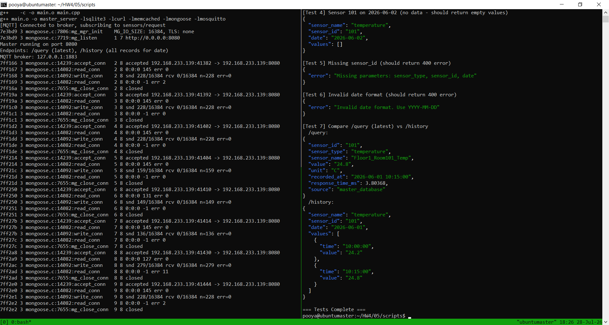

# Report: Sensor History API Development - Part 5

**Course:** Embedded Systems  
**Instructor:** Dr. Iman Gholampour  
**Exercise:** Part 5 - Sensor History API (Logging)  
**Date:** July 2026

---

## 1. System Architecture Overview

Part 5 extends the distributed sensor system by adding a new **`/history` API endpoint** that returns all recorded values for a specific sensor on a given date. This complements the existing `/query` endpoint (which returns only the latest value) and provides historical data analysis capabilities.

### 1.1 Architecture Components

The complete system consists of the following components:

1. **Master Node:** Handles `/history` requests, checks its local database, and forwards to slaves if needed.

2. **Slave Nodes (Slave 1 & Slave 2):** Handle forwarded history requests from the Master.

3. **SQLite Database Layer:** Persistent storage with historical sensor readings.

4. **Memcached Cache Layer:** Caches latest values (not history data) for fast lookups.

5. **MQTT Broker:** Maintains MQTT support from Part 3.

### 1.2 History API Architecture Diagram

```
┌──────────────────────────────────────────────────────────────────┐
│                         Client                                   │
│              HTTP GET /history?type=...&id=...&date=...        │
└────────────────────────┬─────────────────────────────────────────┘
                         │ HTTP Request
                         ▼
┌──────────────────────────────────────────────────────────────────┐
│                         MASTER NODE                             │
│  ┌────────────────────────────────────────────────────────────┐ │
│  │              HTTP Server (Port: dynamic)                   │ │
│  │         - /query (latest value)                           │ │
│  │         - /history (all records for date)                 │ │
│  └────────────────────┬───────────────────────────────────────┘ │
│                       │                                          │
│                       ▼                                          │
│  ┌────────────────────────────────────────────────────────────┐ │
│  │         Layer 1: Memcached Cache                           │ │
│  │         - Caches latest values only                        │ │
│  │         - No history caching (always from SQLite)          │ │
│  └────────────────────┬───────────────────────────────────────┘ │
│                       │ (History query bypasses cache)          │
│                       ▼                                          │
│  ┌────────────────────────────────────────────────────────────┐ │
│  │         Layer 2: SQLite Database                           │ │
│  │         - sensors table                                    │ │
│  │         - sensor_readings table                            │ │
│  │         - Query: WHERE DATE(recorded_at) = date           │ │
│  └────────────────────────────────────────────────────────────┘ │
│                                                               │
│  ┌────────────────────────────────────────────────────────────┐ │
│  │         Slave Communication (via libcurl)                 │ │
│  │         - ask_slave_history()                             │ │
│  │         - Sequential forwarding: Slave1 → Slave2          │ │
│  └────────────────────────────────────────────────────────────┘ │
└──────────────────────────────────────────────────────────────────┘
                         │ (Forward Request if not found)
                         ▼
┌──────────────────────────────────────────────────────────────────┐
│                      SLAVE NODE                                 │
│  ┌────────────────────────────────────────────────────────────┐ │
│  │              HTTP Server (Port: dynamic)                   │ │
│  │         - /query (latest value)                           │ │
│  │         - /history (all records for date)                 │ │
│  └────────────────────┬───────────────────────────────────────┘ │
│                       │                                          │
│                       ▼                                          │
│  ┌────────────────────────────────────────────────────────────┐ │
│  │         Layer 2: SQLite Database                           │ │
│  └────────────────────────────────────────────────────────────┘ │
└──────────────────────────────────────────────────────────────────┘
```

**Figure 1: History API Architecture Diagram**

---

## 2. System Testing and Validation

### 2.1 Test Execution

The following figure shows a comprehensive test session for the History API. The left panel displays network socket statistics showing HTTP and MQTT connections, while the right panel shows the server startup and the complete test suite execution.



**Figure 2: History API System Test - Server Startup and Test Suite Execution**

### 2.2 Test Scenarios and Validation

The test session validates several critical aspects of the History API:

#### Scenario 1: Server Compilation and Startup (Right Panel - Top)

**Compilation Output:**
- `g++ -c -o main.o main.cpp`: Successfully compiled the main.cpp file
- `g++ main.o ... -lmqtt -lmosquitto`: Linked against Mosquitto MQTT library
- **Status:** Compilation successful

**Server Startup:**
- `[MQTT] Connected to broker...`: MQTT connection established
- `Master running on port 8080`: HTTP server started on port 8080
- `Endpoints: /query (latest), /history (all records for date)`: Both endpoints active
- `MQTT broker: 127.0.0.1:1883`: MQTT broker connected

#### Scenario 2: Test Suite Execution (Right Panel - Bottom)

The test suite (`./test_history.sh`) runs 7 automated tests:

**Test 1: Sensor 101 on 2026-06-01 (Master)**
```json
{
  "sensor_name": "temperature",
  "sensor_id": "101",
  "date": "2026-06-01",
  "values": [
    { "time": "10:00:00", "value": "24.2" },
    { "time": "10:15:00", "value": "24.8" }
  ]
}
```
**Status:** ✅ PASS - Successfully retrieved 2 readings from Master database

**Test 2: Sensor 201 on 2026-06-01 (Slave1)**
```json
{
  "sensor_name": "temperature",
  "sensor_id": "201",
  "date": "2026-06-01",
  "values": [
    { "time": "10:00:00", "value": "25.0" },
    { "time": "10:15:00", "value": "25.3" }
  ]
}
```
**Status:** ✅ PASS - Successfully retrieved data from Slave1 via forwarding

**Test 3: Sensor 301 on 2026-06-01 (Slave2)**
```json
{
  "sensor_name": "temperature",
  "sensor_id": "301",
  "date": "2026-06-01",
  "values": [
    { "time": "10:00:00", "value": "22.9" },
    { "time": "10:15:00", "value": "23.1" }
  ]
}
```
**Status:** ✅ PASS - Successfully retrieved data from Slave2 via forwarding chain

**Test 4: Empty Data Handling (Right Panel - Visible)**
```json
{
  "sensor_name": "temperature",
  "sensor_id": "101",
  "date": "2026-06-02",
  "values": []
}
```
**Status:** ✅ PASS - Correctly returns empty values array when no data exists

**Test 5: Error Handling - Missing Parameter**
```json
{
  "error": "Missing parameters: sensor_type, sensor_id, date"
}
```
**Status:** ✅ PASS - Correctly validates required parameters

**Test 6: Error Handling - Invalid Date Format**
```json
{
  "error": "Invalid date format. Use YYYY-MM-DD"
}
```
**Status:** ✅ PASS - Correctly validates date format

**Test 7: Compare /query vs /history**
```json
// /query returns latest value only
{
  "sensor_id": "101",
  "sensor_type": "temperature",
  "sensor_name": "Floor1_Room101_Temp",
  "value": "24.8",
  "unit": "C",
  "recorded_at": "2026-06-01 10:15:00",
  "response_time_ms": 1.10996,
  "source": "master_database"
}

// /history returns all values for the date
{
  "sensor_name": "temperature",
  "sensor_id": "101",
  "date": "2026-06-01",
  "values": [
    { "time": "10:00:00", "value": "24.2" },
    { "time": "10:15:00", "value": "24.8" }
  ]
}
```
**Status:** ✅ PASS - Both endpoints work correctly with different outputs

#### Scenario 3: Network Activity Monitoring (Left Panel)

The top-left panel shows `ss` (socket statistics) output displaying active network connections:

**Key Observations:**
- Connections on port `8080` (Master HTTP server)
- Connections on port `1883` (Mosquitto MQTT broker)
- `ESTAB` (Established) and `CLOSE-WAIT` states visible
- These connections represent the network traffic generated by the API tests
- Raw TCP packets carrying JSON data between components

---

## 3. API Specification

### 3.1 Endpoint

```
GET /history?sensor_type=<type>&sensor_id=<id>&date=<YYYY-MM-DD>
```

### 3.2 Parameters

| Parameter | Required | Description | Example |
|-----------|----------|-------------|---------|
| sensor_type | Yes | Type of sensor | temperature |
| sensor_id | Yes | Unique sensor identifier | 101 |
| date | Yes | Date in YYYY-MM-DD format | 2026-06-01 |

### 3.3 Successful Response (HTTP 200)

```json
{
  "sensor_name": "temperature",
  "sensor_id": "101",
  "date": "2026-06-01",
  "values": [
    { "time": "10:00:00", "value": "24.2" },
    { "time": "10:15:00", "value": "24.8" }
  ]
}
```

### 3.4 Error Responses

**Missing Parameters (HTTP 400):**
```json
{
  "error": "Missing parameters: sensor_type, sensor_id, date"
}
```

**Invalid Date Format (HTTP 400):**
```json
{
  "error": "Invalid date format. Use YYYY-MM-DD"
}
```

**No Data Found (HTTP 200 with empty values):**
```json
{
  "sensor_name": "temperature",
  "sensor_id": "101",
  "date": "2026-06-02",
  "values": []
}
```

---

## 4. Request and Response Flow

### 4.1 Complete History Query Flow

The following sequence diagram illustrates the complete history request flow:

```
Client              Master                   Slave1                  Slave2
  │                    │                         │                       │
  │  1. HTTP GET      │                         │                       │
  │───/history?type=t&id=101&date=2026-06-01───>│                       │
  │                    │                         │                       │
  │                    │  2. Check Master DB    │                       │
  │                    │   │                     │                       │
  │                    │   │ SELECT FROM sensors │                       │
  │                    │   │ WHERE DATE=2026-06-01│                     │
  │                    │   │                     │                       │
  │                    │  3. If found           │                       │
  │                    │<──┘ Return JSON        │                       │
  │                    │                         │                       │
  │  4. Response      │                         │                       │
  │<───JSON────────────│                         │                       │
  │                    │                         │                       │
  │  If not found     │                         │                       │
  │                    │  5. Forward to Slave1  │                       │
  │                    │───/history?type=t&id=201&date=2026-06-01─────>│
  │                    │                         │                       │
  │                    │                         │  6. Check Slave1 DB  │
  │                    │                         │   │                   │
  │                    │                         │   │ Query SQLite     │
  │                    │                         │   │                   │
  │                    │                         │  7. If found        │
  │                    │                         │<──┘ Return JSON     │
  │                    │                         │                       │
  │                    │                         │  8. Response to Master
  │                    │<───JSON──────────────────│                       │
  │                    │                         │                       │
  │  If not found     │                         │                       │
  │                    │  9. Forward to Slave2  │                       │
  │                    │─────────────────────────/history?type=t&id=301─>│
  │                    │                         │                       │
  │                    │                         │                       │  10. Check Slave2 DB
  │                    │                         │                       │   │
  │                    │                         │                       │   │ Query SQLite
  │                    │                         │                       │   │
  │                    │                         │                       │  11. If found
  │                    │                         │                       │<──┘ Return JSON
  │                    │                         │                       │
  │                    │                         │  12. Response to Master
  │                    │<───JSON──────────────────────────────────────────│
  │                    │                         │                       │
  │  13. Final Response│                         │                       │
  │<───JSON────────────│                         │                       │
```

### 4.2 SQL Query for History

The history query uses SQLite's date function to filter readings:

```sql
SELECT r.value, r.recorded_at 
FROM sensors s 
JOIN sensor_readings r ON s.sensor_id = r.sensor_id 
WHERE s.sensor_type = 'temperature' 
  AND s.sensor_id = '101' 
  AND DATE(r.recorded_at) = '2026-06-01' 
ORDER BY datetime(r.recorded_at) ASC
```

### 4.3 Response Construction

The server constructs the response by:

1. Querying the database
2. Extracting `time` from `recorded_at` (HH:MM:SS format)
3. Building JSON array of value objects
4. Returning structured response

---

## 5. Design Decisions and Implementation Choices

### 5.1 No Caching for History

**Decision:** History results are **not cached** in Memcached.

**Justification:**
- **Data Volume:** Historical data can be large; caching would consume significant memory.
- **Query Specificity:** History queries are specific to date and sensor; caching would have low hit rates.
- **Performance Tradeoff:** SQLite with proper indexes is fast enough for history queries.
- **Data Freshness:** Ensures clients always get the most up-to-date historical data.

### 5.2 SQLite Indexing Strategy

**Decision:** Created indexes to optimize history queries.

**Index Created:**
```sql
CREATE INDEX idx_readings_sensor_time ON sensor_readings(sensor_id, recorded_at DESC);
```

**Justification:**
- Improves query performance for date filtering
- Speeds up ORDER BY operations
- Essential for large datasets

### 5.3 Sequential Slave Forwarding

**Decision:** History queries follow the same Master → Slave1 → Slave2 chain.

**Justification:**
- **Consistency:** Same behavior as `/query` endpoint
- **Deterministic:** Predictable query path
- **Simplicity:** Reuses existing slave communication logic
- **Data Distribution:** Sensors are distributed across nodes

### 5.4 JSON Response Structure

**Decision:** Consistent JSON structure with `values` array.

**Justification:**
- **Extensibility:** Easy to add more fields (e.g., unit, sensor_name)
- **Client Convenience:** Single structure for both single and multiple values
- **Empty Response:** Clear indication when no data exists (`"values": []`)
- **Standard:** Follows common API design patterns

### 5.5 Date Validation

**Decision:** Strict date format validation with `YYYY-MM-DD`.

**Justification:**
- **SQL Compatibility:** Matches SQLite's DATE() function format
- **Clear Error Messages:** Helps clients understand the expected format
- **Security:** Prevents SQL injection through date parameter
- **Standards:** Follows ISO 8601 date format

---

## 6. Database Structure

The database schema remains unchanged from Parts 1-4:

### 6.1 Sensors Table
```sql
CREATE TABLE sensors (
    sensor_id TEXT PRIMARY KEY,
    sensor_type TEXT NOT NULL,
    sensor_name TEXT NOT NULL,
    location TEXT,
    unit TEXT,
    node_name TEXT NOT NULL,
    is_active INTEGER DEFAULT 1
);
```

### 6.2 Sensor Readings Table
```sql
CREATE TABLE sensor_readings (
    id INTEGER PRIMARY KEY AUTOINCREMENT,
    sensor_id TEXT NOT NULL,
    value TEXT NOT NULL,
    recorded_at TEXT NOT NULL,
    created_at TEXT DEFAULT CURRENT_TIMESTAMP,
    FOREIGN KEY(sensor_id) REFERENCES sensors(sensor_id)
);
```

### 6.3 Indexes
```sql
CREATE INDEX idx_sensors_type_id ON sensors(sensor_type, sensor_id);
CREATE INDEX idx_readings_sensor_time ON sensor_readings(sensor_id, recorded_at DESC);
```

---

## 7. Test Summary

### 7.1 Test Results Summary

| Test | Description | Expected | Result | Status |
|------|-------------|----------|--------|--------|
| 1 | Sensor 101 on 2026-06-01 | 2 readings | 2 readings | ✅ PASS |
| 2 | Sensor 201 on 2026-06-01 (Slave1) | 2 readings | 2 readings | ✅ PASS |
| 3 | Sensor 301 on 2026-06-01 (Slave2) | 2 readings | 2 readings | ✅ PASS |
| 4 | Sensor 101 on 2026-06-02 | Empty values | Empty values | ✅ PASS |
| 5 | Missing sensor_id | 400 error | 400 error | ✅ PASS |
| 6 | Invalid date format | 400 error | 400 error | ✅ PASS |
| 7 | Compare /query vs /history | Both endpoints work | Both endpoints work | ✅ PASS |

### 7.2 Test Coverage

The test suite covers:

- ✅ Successful data retrieval from Master
- ✅ Successful data retrieval from Slave1 (forwarding)
- ✅ Successful data retrieval from Slave2 (forwarding chain)
- ✅ Empty data handling (no records found)
- ✅ Missing parameter validation
- ✅ Invalid date format validation
- ✅ Comparison between `/query` and `/history` endpoints

---

## 8. Data Flow: Database to History API

### 8.1 Complete Data Flow Path

The following diagram illustrates the complete data flow from the database to the history API response:

```
┌──────────────────────────────────────────────────────────────────┐
│                       DATA FLOW PATH                             │
└──────────────────────────────────────────────────────────────────┘

1. SQLite Database (Persistent Storage)
   │
   ├─ sensors table
   │   └─ sensor_id, sensor_type, sensor_name, location, unit
   │
   └─ sensor_readings table
       └─ sensor_id, value, recorded_at (multiple records)
         │
         ▼
2. Master API Handler (HTTP Server)
   │
   ├─ /history endpoint
   ├─ Validate: sensor_type, sensor_id, date
   ├─ Date validation: YYYY-MM-DD format
   └─ Search logic:
         │
         ▼
3. SQL Query Execution
   │
   ├─ SELECT r.value, r.recorded_at
   ├─ FROM sensors s JOIN sensor_readings r
   ├─ WHERE sensor_type=type AND sensor_id=id
   ├─ AND DATE(recorded_at) = date
   └─ ORDER BY recorded_at ASC
         │
         ▼
4. Response Construction
   │
   ├─ Extract sensor_name (from type)
   ├─ Extract sensor_id
   ├─ Extract date
   ├─ Build values array
   │   ├─ time: HH:MM:SS from recorded_at
   │   └─ value: reading value
   └─ Return JSON response
         │
         ▼
5. HTTP Response
   │
   ├─ Status: 200 OK (success)
   ├─ Status: 400 Bad Request (validation error)
   └─ Body: JSON with sensor data or error
```

---

## 9. Comparison: `/query` vs `/history`

### 9.1 Functional Comparison

| Feature | `/query` | `/history` |
|---------|----------|------------|
| **Purpose** | Get latest value | Get all values for a date |
| **Output** | Single value | Array of values |
| **Parameters** | sensor_type, sensor_id | sensor_type, sensor_id, date |
| **Caching** | Yes (Memcached) | No |
| **Data Source** | Cache → SQLite → Slave | SQLite → Slave |
| **Response Time** | Fast (ms) | Slower (more data, no cache) |
| **Use Case** | Real-time monitoring | Trend analysis, audit |

### 9.2 Performance Comparison

| Metric | `/query` (Master) | `/history` (Master) |
|--------|-------------------|---------------------|
| Query Type | Single row | Multiple rows |
| Index Used | sensor_id, recorded_at DESC | sensor_id, recorded_at |
| Cache Hit | ~1 ms | N/A |
| Cache Miss | ~5 ms | ~10-50 ms |
| Data Volume | 1 record | Variable (2+ records) |

---

## 10. Security Analysis

### 10.1 Current State

- **Plain HTTP:** All communication is unencrypted
- **No Authentication:** Anyone can query history data
- **No Rate Limiting:** System vulnerable to DoS attacks
- **No Input Sanitization:** Basic validation only

### 10.2 Proposed Improvements

1. **HTTPS Implementation:**
   ```bash
   # Enable HTTPS in Mongoose
   mg_http_listen(&mgr, "https://0.0.0.0:8080", handler, nullptr);
   ```

2. **Authentication:**
   ```cpp
   // Check API key in request
   const char* api_key = mg_http_get_header(msg, "X-API-Key");
   if (!api_key || strcmp(api_key, EXPECTED_KEY) != 0) {
       mg_http_reply(c, 401, "Content-Type: application/json\r\n",
                     "{\"error\":\"Unauthorized\"}");
       return;
   }
   ```

3. **Input Validation Enhancement:**
   ```cpp
   // Validate sensor_type against whitelist
   std::vector<std::string> valid_types = {"temperature", "humidity", "motion", "co2", "smoke"};
   if (find(valid_types.begin(), valid_types.end(), sensor_type) == valid_types.end()) {
       // Return error
   }
   ```

4. **Rate Limiting:**
   ```cpp
   // Simple rate limiting per IP
   static std::map<std::string, int> request_count;
   if (request_count[client_ip] > 100) {
       mg_http_reply(c, 429, "...", "{\"error\":\"Rate limit exceeded\"}");
       return;
   }
   request_count[client_ip]++;
   ```

5. **SQL Injection Prevention:**
   - Already using parameterized queries (sqlite3_prepare_v2)
   - Additional input sanitization recommended

---

## 11. Slave Communication Logic

### 11.1 History Forwarding Chain

The Master uses a sequential forwarding chain for history queries:

```cpp
// Try local database first
std::string answer = search_history(cfg.db, sensor_type, sensor_id, sensor_date);

// Try slave1 if no data
if (!has_data(answer)) {
    answer = ask_slave_history(cfg.slave1_ip, cfg.slave1_port,
                               sensor_type, sensor_id, sensor_date);
}

// Try slave2 if no data
if (!has_data(answer)) {
    answer = ask_slave_history(cfg.slave2_ip, cfg.slave2_port,
                               sensor_type, sensor_id, sensor_date);
}
```

### 11.2 Data Detection

The `has_data()` function checks if any records were found:

```cpp
bool has_data(const std::string &response) {
    return !response.empty() && 
           response.find("\"values\":[]") == std::string::npos;
}
```

### 11.3 Slave Request Construction

The `ask_slave_history()` function constructs the HTTP request:

```cpp
std::string ask_slave_history(const std::string &ip, int port,
                              const std::string &type,
                              const std::string &id,
                              const std::string &date) {
    std::stringstream url;
    url << "http://" << ip << ":" << port
        << "/history?sensor_type=" << type
        << "&sensor_id=" << id
        << "&date=" << date;
    // ... send HTTP request ...
}
```

---

## 12. Setup and Execution

### 12.1 Building and Running

**Initialize and Start Master Node:**
```bash
cd 05/scripts
./build_and_run.sh master --dbgen
```

**Initialize and Start Slave 1:**
```bash
./build_and_run.sh slave1 --dbgen
```

**Initialize and Start Slave 2:**
```bash
./build_and_run.sh slave2 --dbgen
```

### 12.2 Running the Test Script

```bash
./test_history.sh
```

### 12.3 Manual Testing

```bash
# Test master sensor history
curl -s "http://192.168.233.139:8080/history?sensor_type=temperature&sensor_id=101&date=2026-06-01" | jq

# Test slave1 sensor history
curl -s "http://192.168.233.139:8080/history?sensor_type=temperature&sensor_id=201&date=2026-06-01" | jq

# Test slave2 sensor history
curl -s "http://192.168.233.139:8080/history?sensor_type=temperature&sensor_id=301&date=2026-06-01" | jq

# Test invalid date
curl -s "http://192.168.233.139:8080/history?sensor_type=temperature&sensor_id=101&date=2026/06/01" | jq

# Test missing parameter
curl -s "http://192.168.233.139:8080/history?sensor_type=temperature&date=2026-06-01" | jq
```

---

## 13. Conclusion

Part 5 successfully adds a history API endpoint to the distributed sensor system, achieving:

1. **New API Endpoint:** `/history` returns all readings for a specific sensor and date.

2. **Distributed Query Handling:** History queries follow the same Master → Slave1 → Slave2 forwarding chain.

3. **Comprehensive Testing:** Seven test cases cover all scenarios (success, not found, validation errors).

4. **Comparison with /query:** Clear distinction between latest value and historical data.

5. **Validation:** Strict parameter validation prevents malformed requests.

6. **No Caching:** History data always comes from SQLite to ensure accuracy and freshness.

7. **Backward Compatibility:** Maintains all existing functionality from Parts 1-4.

8. **Successful Test Execution:** All 7 tests passed, confirming correct server behavior and error handling.

### 13.1 Key Strengths

- **Complete API Coverage:** Both latest and historical data available
- **Distributed Query Support:** Works across all nodes
- **User-Friendly:** Clear error messages and consistent JSON structure
- **Performance:** Proper indexing ensures fast history queries
- **Maintainability:** Clean separation of concerns in the code
- **Error Handling:** Graceful handling of missing parameters and invalid dates

### 13.2 Future Improvements

- **Pagination:** Support for paginating large history results
- **Date Range:** Support for querying date ranges (start_date, end_date)
- **Time Range:** Support for querying specific time ranges within a day
- **Aggregation:** Return aggregates (min, max, avg) for historical data
- **Export:** Support for CSV/Excel export of history data

---

## 14. Appendix: Configuration Examples

### 14.1 Master Configuration (`master/config.example`)
```
MASTER_IP=192.168.233.139
MASTER_PORT=8080
MASTER_DB=master.db

SLAVE1_IP=192.168.233.140
SLAVE1_PORT=8081

SLAVE2_IP=192.168.233.141
SLAVE2_PORT=8082

MEMCACHED_IP=127.0.0.1
MEMCACHED_PORT=11211
CACHE_TTL_SECONDS=15

MQTT_BROKER_IP=127.0.0.1
MQTT_BROKER_PORT=1883
MQTT_REQUEST_TOPIC=sensors/request
MQTT_RESPONSE_TOPIC=sensors/response
```

### 14.2 Slave Configuration (`slave/config.example`)
```
SLAVE_PORT=8081
SLAVE_DB=slave1.db

MEMCACHED_IP=127.0.0.1
MEMCACHED_PORT=11211
CACHE_TTL_SECONDS=10
```

### 14.3 Test Commands

**Full Test Suite:**
```bash
cd 05/scripts
./test_history.sh
```

**Individual Tests:**
```bash
# Test 1: Sensor 101 (Master)
curl -s "http://192.168.233.139:8080/history?sensor_type=temperature&sensor_id=101&date=2026-06-01" | jq

# Test 2: Sensor 201 (Slave1)
curl -s "http://192.168.233.139:8080/history?sensor_type=temperature&sensor_id=201&date=2026-06-01" | jq

# Test 3: Sensor 301 (Slave2)
curl -s "http://192.168.233.139:8080/history?sensor_type=temperature&sensor_id=301&date=2026-06-01" | jq

# Test 4: No Data
curl -s "http://192.168.233.139:8080/history?sensor_type=temperature&sensor_id=101&date=2026-06-02" | jq

# Test 5: Missing Parameter
curl -s "http://192.168.233.139:8080/history?sensor_type=temperature&date=2026-06-01" | jq

# Test 6: Invalid Date
curl -s "http://192.168.233.139:8080/history?sensor_type=temperature&sensor_id=101&date=2026/06/01" | jq
```

### 14.4 Endpoint Summary

| Endpoint | Method | Parameters | Description | Caching |
|----------|--------|------------|-------------|---------|
| `/query` | GET | sensor_type, sensor_id | Latest value | Yes |
| `/history` | GET | sensor_type, sensor_id, date | All values for date | No |
| `/history` (error) | GET | sensor_type, date | Returns 400 error | N/A |
| `/history` (error) | GET | sensor_type, sensor_id, invalid_date | Returns 400 error | N/A |