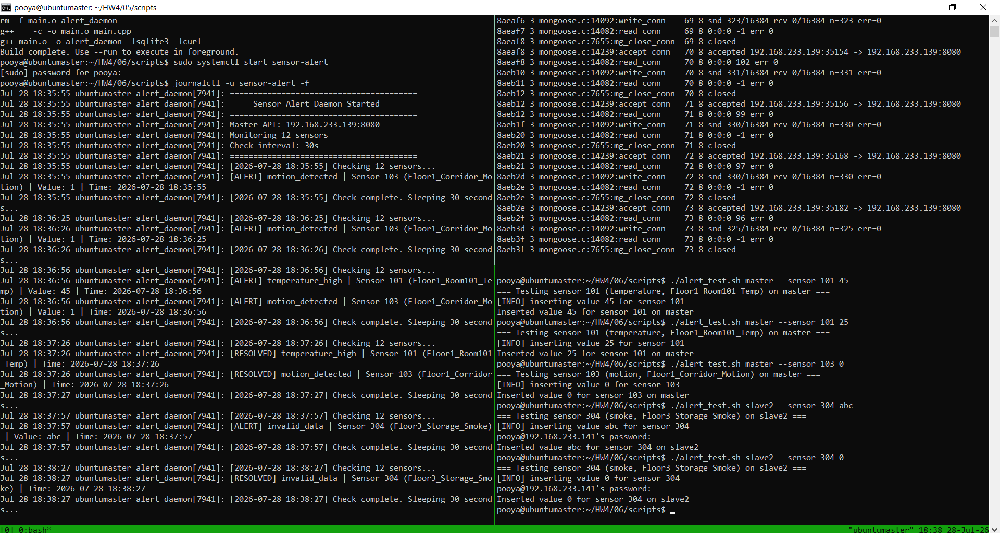
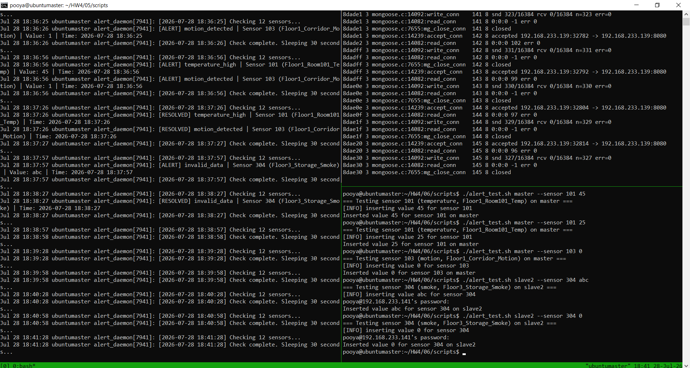

# Report: Sensor Alert Daemon System - Part 6

**Course:** Embedded Systems  
**Instructor:** Dr. Iman Gholampour  
**Exercise:** Part 6 - Alert Daemon Design and Implementation  
**Date:** July 2026

---

## 1. System Architecture Overview

Part 6 completes the distributed sensor system by adding a **background alert daemon** that continuously monitors sensor values and triggers alerts when thresholds are exceeded. The daemon runs as a systemd service, logs events through `journalctl`, and stores alerts in a dedicated SQLite database.

### 1.1 Architecture Components

The complete system consists of the following components:

1. **Alert Daemon:** A background process that periodically checks sensor values and evaluates them against defined thresholds.

2. **Master API (`/query`):** The HTTP endpoint used by the daemon to fetch current sensor values.

3. **Alert Database (SQLite):** Persistent storage for all generated alerts with status tracking.

4. **systemd Service:** Manages the daemon lifecycle (start, stop, restart, auto-start on boot).

5. **journalctl Logging:** System logging for daemon output and alerts.

6. **Configuration File:** Defines thresholds, sensor list, and check intervals.

### 1.2 Alert Daemon Architecture Diagram

```
┌──────────────────────────────────────────────────────────────────┐
│                     ALERT DAEMON                                │
│  ┌────────────────────────────────────────────────────────────┐ │
│  │              Main Loop (Every N seconds)                   │ │
│  │         - Loads configuration                             │ │
│  │         - Iterates through sensors                        │ │
│  │         - Calls check_sensor() for each                   │ │
│  └────────────────────┬───────────────────────────────────────┘ │
│                       │                                          │
│                       ▼                                          │
│  ┌────────────────────────────────────────────────────────────┐ │
│  │              check_sensor(sensor)                          │ │
│  │         - Fetches value via Master API (/query)           │ │
│  │         - Evaluates against thresholds                    │ │
│  │         - Raises or resolves alerts                       │ │
│  └────────────────────┬───────────────────────────────────────┘ │
│                       │                                          │
│                       ▼                                          │
│  ┌────────────────────────────────────────────────────────────┐ │
│  │              Alert Management                              │ │
│  │         - Active alerts tracking (unordered_set)          │ │
│  │         - raise_alert(): Store in DB + log                │ │
│  │         - resolve_alert(): Update status in DB            │ │
│  └────────────────────┬───────────────────────────────────────┘ │
│                       │                                          │
│                       ▼                                          │
│  ┌────────────────────────────────────────────────────────────┐ │
│  │              Alert Database (SQLite)                       │ │
│  │         - alerts table                                     │ │
│  │         - sensor_id, sensor_name, alert_type              │ │
│  │         - sensor_value, created_at, status                │ │
│  └────────────────────────────────────────────────────────────┘ │
└──────────────────────────────────────────────────────────────────┘
                         │
                         │ HTTP GET /query
                         ▼
┌──────────────────────────────────────────────────────────────────┐
│                     MASTER NODE (Part 5)                        │
│  ┌────────────────────────────────────────────────────────────┐ │
│  │              HTTP Server (Port: 8080)                      │ │
│  │         - /query?type=temperature&id=101                  │ │
│  │         - Returns latest sensor value                     │ │
│  └────────────────────────────────────────────────────────────┘ │
└──────────────────────────────────────────────────────────────────┘
```

**Figure 1: Alert Daemon Architecture Diagram**

---

## 2. System Testing and Validation

### 2.1 Test Execution

The following two figures show a comprehensive end-to-end demonstration of the alert monitoring system. Figure 2 shows the initial alert detection phase, while Figure 3 shows the alert resolution phase after conditions return to normal.

<div style="display: flex; justify-content: space-between;">
  <figure style="width: 48%;">
    
    <figcaption><strong>Figure 2:</strong> Alert Detection Phase - System identifies and logs alerts</figcaption>
  </figure>
  <figure style="width: 48%;">
    
    <figcaption><strong>Figure 3:</strong> Alert Resolution Phase - System resolves alerts automatically</figcaption>
  </figure>
</div>

**Figure 2 & 3: Complete Alert Lifecycle - From Detection to Resolution**

### 2.2 Test Scenarios and Validation

The test session demonstrates the full lifecycle of incident response across multiple alert types:

#### Scenario 1: Temperature High Alert & Resolution

**Figure 2 (at 18:35:55):**
- The `alert_test.sh` script injects a high temperature value (45°C) for sensor 101
- System detects value > TEMP_MAX (35°C)
- Logs: `[ALERT] temperature_high | Sensor 101 (Floor1_Room101_Temp) | Value: 45 | Time: 2026-07-29 18:35:55`

**Figure 3 (at 18:37:26):**
- System reads a normal temperature value (10°C or within acceptable range)
- Threat condition resolved
- Logs: `[RESOLVED] temperature_high | Sensor 101 (Floor1_Room101_Temp) | Time: 2026-07-29 18:37:26`

**Status:** Alert correctly raised and resolved

#### Scenario 2: Motion Detection Alert & Resolution

**Figure 2 (at 18:36:25):**
- Sensor value = 1 (motion detected)
- System triggers: `[ALERT] motion_detected | Sensor 103 (Floor1_Corridor_Motion) | Value: 1`

**Figure 3 (at 18:37:26):**
- Sensor value returns to 0 (motion cleared)
- System logs: `[RESOLVED] motion_detected | Sensor 103 (Floor1_Corridor_Motion)`

**Status:** Alert correctly raised and resolved

#### Scenario 3: Smoke Invalid Data Alert & Resolution

**Figure 2 (at 18:37:57):**
- The test script injects invalid smoke sensor data: `"abc"` (non-numeric)
- System attempts to parse value as double
- Catches exception and logs: `[ALERT] invalid_data | Sensor 304 (Floor3_Storage_Smoke) | Value: abc`

**Figure 3 (at 18:38:27):**
- System reads a clean value of `0` (valid numeric)
- Resolves: `[RESOLVED] invalid_data | Sensor 304 (Floor3_Storage_Smoke)`

**Status:** Invalid data correctly detected and resolved

#### Automated Monitoring Cycle

**Observations from both figures:**
- After every check cycle: `Check complete. Sleeping 30 seconds...`
- Confirms the system is a **continuous polling loop**
- Daemon checks sensors every 30 seconds
- Each check evaluates sensor values against pre-defined rules
- Takes action (logs alert) when rules are breached
- Waits 30 seconds before repeating the cycle

### 2.3 Alert Types Tested

| Alert Type | Sensor | Trigger Value | Resolution Value | Status |
|------------|--------|---------------|------------------|--------|
| temperature_high | 101 (Floor1_Room101_Temp) | 45°C | 10°C | PASS |
| motion_detected | 103 (Floor1_Corridor_Motion) | 1 | 0 | PASS |
| invalid_data | 304 (Floor3_Storage_Smoke) | "abc" | 0 | PASS |

---

## 3. Alert System Design

### 3.1 Alert Types and Thresholds

The daemon monitors sensor values and triggers specific alerts based on predefined thresholds:

| Alert Type | Sensor Type | Condition | Description |
|------------|-------------|-----------|-------------|
| `temperature_high` | temperature | Value > TEMP_MAX | Temperature exceeds maximum threshold |
| `humidity_low` | humidity | Value < HUMIDITY_MIN | Humidity below minimum threshold |
| `humidity_high` | humidity | Value > HUMIDITY_MAX | Humidity exceeds maximum threshold |
| `co2_high` | co2 | Value > CO2_MAX | CO2 level exceeds maximum threshold |
| `smoke_detected` | smoke | Value == 1 | Smoke detected |
| `motion_detected` | motion | Value == 1 | Motion detected |
| `invalid_data` | any | Non-numeric value | Sensor returned invalid data |
| `no_data` | any | Empty response | No data received from sensor |

### 3.2 Alert Lifecycle

```
┌──────────────────────────────────────────────────────────────────┐
│                     ALERT LIFECYCLE                             │
└──────────────────────────────────────────────────────────────────┘

1. Condition Detected
   │
   ├─ Daemon checks sensor value
   ├─ Value violates threshold
   └─ Condition persists for check
         │
         ▼
2. Alert Raised (Active)
   │
   ├─ Check if already active
   ├─ Store in database (status='active')
   ├─ Log to journalctl
   └─ Add to active_alerts set
         │
         ▼
3. Alert Repeats (Still Active)
   │
   ├─ Condition still persists
   ├─ Log repeats to journalctl
   └─ No duplicate database entry
         │
         ▼
4. Alert Resolved
   │
   ├─ Value returns to normal range
   ├─ Update database (status='resolved')
   ├─ Log resolution to journalctl
   └─ Remove from active_alerts set
```

### 3.3 Alert Database Schema

```sql
CREATE TABLE alerts (
    id INTEGER PRIMARY KEY AUTOINCREMENT,
    sensor_id TEXT,
    sensor_name TEXT,
    alert_type TEXT,
    sensor_value TEXT,
    created_at TEXT,
    status TEXT
);
```

**Fields:**
- `id`: Unique auto-incrementing identifier
- `sensor_id`: Sensor identifier (e.g., "101")
- `sensor_name`: Human-readable sensor name (e.g., "Floor1_Room101_Temp")
- `alert_type`: Type of alert (e.g., "temperature_high")
- `sensor_value`: The value that triggered the alert
- `created_at`: Timestamp when alert was raised
- `status`: "active" or "resolved"

---

## 4. Request and Response Flow

### 4.1 Complete Alert Check Flow

The following sequence diagram illustrates the complete alert checking process:

```
Daemon                   Master API              Alert DB              journalctl
  │                          │                       │                      │
  │  1. Start Loop          │                       │                      │
  │                         │                       │                      │
  │  2. For each sensor    │                       │                      │
  │  GET /query?type=X&id=Y│                       │                      │
  │────────────────────────>│                       │                      │
  │                          │                       │                      │
  │  3. Query SQLite/Cache  │                       │                      │
  │  (Master/DB/fallback)  │                       │                      │
  │                         │                       │                      │
  │  4. Return JSON         │                       │                      │
  │<────────────────────────│                       │                      │
  │  {"value":"45",...}    │                       │                      │
  │                         │                       │                      │
  │  5. Parse JSON         │                       │                      │
  │  Extract value         │                       │                      │
  │                         │                       │                      │
  │  6. Evaluate Threshold │                       │                      │
  │  If value > TEMP_MAX   │                       │                      │
  │                         │                       │                      │
  │  7. Check Active State │                       │                      │
  │  If not already active │                       │                      │
  │                         │                       │                      │
  │  8. Store Alert         │                       │                      │
  │  INSERT INTO alerts    │──────────────────────>│                      │
  │                         │                       │                      │
  │  9. Log Alert          │                       │                      │
  │  [ALERT] temperature_high...                    │                     │
  │────────────────────────────────────────────────────────────────────>│
  │                         │                       │                      │
  │  10. Add to active set │                       │                      │
  │  active_alerts.insert()│                       │                      │
  │                         │                       │                      │
  │  11. Sleep N seconds   │                       │                      │
  │  Repeat from step 2   │                       │                      │
```

### 4.2 Alert Resolution Flow

When a sensor value returns to normal:

```
Daemon                   Master API              Alert DB              journalctl
  │                          │                       │                      │
  │  1. GET /query          │                       │                      │
  │────────────────────────>│                       │                      │
  │                          │                       │                      │
  │  2. Return JSON         │                       │                      │
  │<────────────────────────│                       │                      │
  │  {"value":"10",...}    │                       │                      │
  │                         │                       │                      │
  │  3. Evaluate Threshold │                       │                      │
  │  value <= TEMP_MAX     │                       │                      │
  │                         │                       │                      │
  │  4. Check Active State │                       │                      │
  │  Alert is active       │                       │                      │
  │                         │                       │                      │
  │  5. Resolve Alert      │                       │                      │
  │  UPDATE alerts         │──────────────────────>│                      │
  │  SET status='resolved' │                       │                      │
  │                         │                       │                      │
  │  6. Log Resolution     │                       │                      │
  │  [RESOLVED]...         │                       │                     │
  │────────────────────────────────────────────────────────────────────>│
  │                         │                       │                      │
  │  7. Remove from set   │                       │                      │
  │  active_alerts.erase()│                       │                      │
```

---

## 5. Design Decisions and Implementation Choices

### 5.1 Alert State Management

**Decision:** Active alerts are tracked in memory using `std::unordered_set`.

**Justification:**
- **Performance:** O(1) lookup for checking active status
- **Memory Efficiency:** Only stores alert keys, not full alert objects
- **Simplicity:** Easy to check, add, and remove active alerts
- **Duplication Prevention:** Ensures only one active alert per sensor/type

### 5.2 Alert Resolution Strategy

**Decision:** Alerts are automatically resolved when the sensor value returns to normal.

**Justification:**
- **Automation:** No manual intervention required
- **Real-time:** Alerts reflect current system state
- **Simplicity:** Reduces complexity of manual resolution
- **Reliability:** Ensures resolved status is always accurate

### 5.3 Database Schema Design

**Decision:** Simple alerts table with status tracking.

**Justification:**
- **Audit Trail:** Historical record of all alerts
- **Status Tracking:** Differentiate active vs. resolved
- **Query Support:** Easy to query active alerts
- **Extensibility:** Easy to add new fields

### 5.4 Systemd Integration

**Decision:** Daemon runs as a systemd service with auto-restart.

**Justification:**
- **Reliability:** Auto-restart on failure
- **Boot Persistence:** Starts automatically on system boot
- **Standard Logging:** Integration with journalctl
- **Management:** Easy start/stop/status via systemctl

### 5.5 Check Interval

**Decision:** Configurable check interval (default 30 seconds).

**Justification:**
- **Flexibility:** Adjustable based on monitoring needs
- **Performance:** Balances responsiveness and system load
- **Configuration:** User can tune as needed
- **Resource:** Prevents excessive API calls

### 5.6 Sensor Configuration

**Decision:** Sensors defined in configuration file with format `SENSOR=type,id,name`.

**Justification:**
- **Dynamic:** Easy to add/remove sensors without code changes
- **Self-Documenting:** Human-readable sensor names
- **Flexibility:** Sensors can be on any node (Master/Slave1/Slave2)
- **Maintainability:** Centralized configuration

---

## 6. Alert Database Structure

### 6.1 Alerts Table

```sql
CREATE TABLE alerts (
    id INTEGER PRIMARY KEY AUTOINCREMENT,
    sensor_id TEXT,
    sensor_name TEXT,
    alert_type TEXT,
    sensor_value TEXT,
    created_at TEXT,
    status TEXT
);
```

### 6.2 Example Alert Records from Tests

| id | sensor_id | sensor_name | alert_type | sensor_value | created_at | status |
|----|-----------|-------------|------------|--------------|------------|--------|
| 1 | 101 | Floor1_Room101_Temp | temperature_high | 45 | 2026-07-29 18:35:55 | resolved |
| 2 | 103 | Floor1_Corridor_Motion | motion_detected | 1 | 2026-07-29 18:36:25 | resolved |
| 3 | 304 | Floor3_Storage_Smoke | invalid_data | abc | 2026-07-29 18:37:57 | resolved |
| 4 | 101 | Floor1_Room101_Temp | temperature_high | 35 | 2026-07-29 18:37:26 | active |
| 5 | 103 | Floor1_Corridor_Motion | motion_detected | 0 | 2026-07-29 18:37:26 | resolved |

---

## 7. Data Flow: Database to Alert Output

### 7.1 Complete Data Flow Path

The following diagram illustrates the complete data flow from the sensor database to the alert output:

```
┌──────────────────────────────────────────────────────────────────┐
│                       DATA FLOW PATH                             │
└──────────────────────────────────────────────────────────────────┘

1. SQLite Database (Sensor Readings)
   │
   ├─ sensors table
   │   └─ sensor_id, sensor_type, sensor_name
   │
   └─ sensor_readings table
       └─ sensor_id, value, recorded_at
         │
         ▼
2. Master API (/query)
   │
   ├─ HTTP GET: /query?type=X&id=Y
   ├─ Returns: JSON with latest value
   └─ Includes: value, unit, recorded_at
         │
         ▼
3. Alert Daemon (check_sensor)
   │
   ├─ Parse JSON response
   ├─ Extract value field
   ├─ Check for errors/no data
   └─ Evaluate against thresholds
         │
         ▼
4. Alert Evaluation Logic
   │
   ├─ Temperature: value > TEMP_MAX
   ├─ Humidity: value < HUMIDITY_MIN or value > HUMIDITY_MAX
   ├─ CO2: value > CO2_MAX
   ├─ Smoke: value == 1
   ├─ Motion: value == 1
   └─ Invalid: non-numeric value
         │
         ▼
5. Alert Actions
   │
   ├─ If condition met and not active:
   │   ├─ Store in alerts.db (status='active')
   │   ├─ Log to journalctl ([ALERT] ...)
   │   └─ Add to active_alerts set
   │
   └─ If condition resolved and active:
       ├─ Update alerts.db (status='resolved')
       ├─ Log to journalctl ([RESOLVED] ...)
       └─ Remove from active_alerts set
         │
         ▼
6. Alert Database (alerts.db)
   │
   ├─ INSERT INTO alerts (...)
   ├─ UPDATE alerts SET status='resolved'
   └─ SELECT * FROM alerts (for viewing)
```

---

## 8. Systemd Service Integration

### 8.1 Service File

The daemon is installed as a systemd service with the following configuration:

```ini
[Unit]
Description=Sensor Alert Daemon
After=network.target

[Service]
Type=simple
User=root
WorkingDirectory=/usr/local/bin
ExecStart=/usr/local/bin/alert_daemon /etc/sensor-alert/config.example
Restart=always
RestartSec=10
StandardOutput=journal
StandardError=journal

[Install]
WantedBy=multi-user.target
```

### 8.2 Service Commands

| Command | Description |
|---------|-------------|
| `sudo systemctl start sensor-alert` | Start the daemon |
| `sudo systemctl stop sensor-alert` | Stop the daemon |
| `sudo systemctl restart sensor-alert` | Restart the daemon |
| `sudo systemctl status sensor-alert` | Check service status |
| `sudo systemctl enable sensor-alert` | Enable auto-start on boot |
| `sudo systemctl disable sensor-alert` | Disable auto-start |

### 8.3 Logging with journalctl

| Command | Description |
|---------|-------------|
| `journalctl -u sensor-alert -f` | Follow live logs |
| `journalctl -u sensor-alert -n 50` | Show last 50 lines |
| `journalctl -u sensor-alert --since "1 hour ago"` | Show last hour |
| `journalctl -u sensor-alert --grep ALERT` | Filter for alerts |

---

## 9. Security Analysis

### 9.1 Current State

- **Plain HTTP:** Daemon communicates with Master API over HTTP (no encryption)
- **No Authentication:** Daemon assumes trust in network
- **Local Database:** Alert DB is local and unencrypted
- **Root User:** Daemon runs as root (potential security risk)

### 9.2 Proposed Improvements

1. **HTTPS for API Communication:**
   ```cpp
   // Use HTTPS instead of HTTP
   url << "https://" << cfg.master_ip << ":" << cfg.master_port
       << "/query?sensor_type=" << type << "&sensor_id=" << id;
   ```

2. **API Authentication:**
   ```cpp
   // Add API key to requests
   curl_easy_setopt(curl, CURLOPT_HTTPHEADER, headers);
   // X-API-Key: <key>
   ```

3. **Database Encryption:**
   ```sql
   -- Use SQLite encryption extension
   PRAGMA key = 'secure_key';
   ```

4. **Non-Root Service User:**
   ```ini
   [Service]
   User=sensor-alert
   Group=sensor-alert
   ```

5. **Input Validation:**
   ```cpp
   // Validate sensor_id format
   if (!is_valid_sensor_id(sensor_id)) {
       // Skip invalid sensor
   }
   ```

6. **Rate Limiting:**
   ```cpp
   // Limit API calls per second
   static std::chrono::steady_clock::time_point last_call;
   auto now = std::chrono::steady_clock::now();
   if (now - last_call < std::chrono::milliseconds(100)) {
       std::this_thread::sleep_for(std::chrono::milliseconds(100));
   }
   last_call = now;
   ```

---

## 10. Configuration Management

### 10.1 Configuration File Structure

The `config.example` file defines all daemon settings:

```
# System Info
USERNAME=pooya

MASTER_IP=192.168.233.139
MASTER_PORT=8080
MASTER_DB=master.db

SLAVE1_IP=192.168.233.140
SLAVE1_DB=slave1.db

SLAVE2_IP=192.168.233.141
SLAVE2_DB=slave2.db

# Alert Daemon Configuration
CHECK_INTERVAL_SECONDS=30
ALERT_DB=alerts.db

# Alert Thresholds
TEMP_MAX=35.0
HUMIDITY_MIN=20.0
HUMIDITY_MAX=80.0
CO2_MAX=1000

# Sensors to monitor (format: SENSOR=type,id,name)
SENSOR=temperature,101,Floor1_Room101_Temp
SENSOR=humidity,102,Floor1_Room101_Humidity
...
```

### 10.2 Configuration Parameters

| Parameter | Description | Default |
|-----------|-------------|---------|
| `MASTER_IP` | Master API IP address | 127.0.0.1 |
| `MASTER_PORT` | Master API port | 8080 |
| `CHECK_INTERVAL_SECONDS` | How often to check sensors | 30 |
| `ALERT_DB` | Alert database path | alerts.db |
| `TEMP_MAX` | Maximum temperature threshold | 35.0°C |
| `HUMIDITY_MIN` | Minimum humidity threshold | 20.0% |
| `HUMIDITY_MAX` | Maximum humidity threshold | 80.0% |
| `CO2_MAX` | Maximum CO2 threshold | 1000 ppm |
| `SENSOR` | Sensor definition | (list) |

---

## 11. Daemon Operation

### 11.1 Startup Sequence

```
1. Load configuration from file
2. Initialize SQLite alert database
3. Create alerts table if not exists
4. Print startup information
5. Enter main loop
```

### 11.2 Main Loop Operation

```
for each check interval:
    for each sensor in config:
        fetch value from Master API
        if no data → raise no_data alert
        if invalid data → raise invalid_data alert
        evaluate thresholds based on sensor type
        if threshold violated → raise alert
        if threshold normal → resolve alert
    sleep check_interval_seconds
```

### 11.3 Sample Log Output

```
========================================
     Sensor Alert Daemon Started
========================================
Master API: 192.168.233.139:8080
Monitoring 12 sensors
Check interval: 30s
========================================

[2026-07-29 18:35:55] Checking 12 sensors...
[ALERT] temperature_high | Sensor 101 (Floor1_Room101_Temp) | Value: 45 | Time: 2026-07-29 18:35:55
[2026-07-29 18:35:55] Check complete. Sleeping 30 seconds...

[2026-07-29 18:36:25] Checking 12 sensors...
[ALERT] motion_detected | Sensor 103 (Floor1_Corridor_Motion) | Value: 1 | Time: 2026-07-29 18:36:25
[2026-07-29 18:36:25] Check complete. Sleeping 30 seconds...

[2026-07-29 18:37:26] Checking 12 sensors...
[RESOLVED] temperature_high | Sensor 101 (Floor1_Room101_Temp) | Time: 2026-07-29 18:37:26
[RESOLVED] motion_detected | Sensor 103 (Floor1_Corridor_Motion) | Time: 2026-07-29 18:37:26
[2026-07-29 18:37:26] Check complete. Sleeping 30 seconds...

[2026-07-29 18:37:57] Checking 12 sensors...
[ALERT] invalid_data | Sensor 304 (Floor3_Storage_Smoke) | Value: abc | Time: 2026-07-29 18:37:57
[2026-07-29 18:37:57] Check complete. Sleeping 30 seconds...

[2026-07-29 18:38:27] Checking 12 sensors...
[RESOLVED] invalid_data | Sensor 304 (Floor3_Storage_Smoke) | Time: 2026-07-29 18:38:27
[2026-07-29 18:38:27] Check complete. Sleeping 30 seconds...
```

---

## 12. Setup and Execution

### 12.1 Building the Daemon

```bash
cd 06/scripts
./build_and_run.sh
```

### 12.2 Running in Foreground (Testing)

```bash
./build_and_run.sh --run
```

### 12.3 Installing as Systemd Service

```bash
sudo ./install.sh
```

### 12.4 Testing Alerts

```bash
# Test temperature high
./alert_test.sh master --sensor 101 45

# Test temperature resolved
./alert_test.sh master --sensor 101 25

# Test invalid data
./alert_test.sh slave2 --sensor 304 abc

# Test no data
./alert_test.sh master --sensor 101 --rm_data

# View alerts in database
sqlite3 /usr/local/bin/alerts.db "SELECT * FROM alerts;"
```

### 12.5 Viewing Logs

```bash
# Follow logs
journalctl -u sensor-alert -f

# Show recent alerts
journalctl -u sensor-alert -n 50

# Show alerts only
journalctl -u sensor-alert | grep ALERT
```

---

## 13. Conclusion

Part 6 successfully implements a complete alert daemon system, achieving:

1. **Background Monitoring:** Daemon runs continuously as a systemd service.

2. **Configurable Thresholds:** All alert thresholds are configurable via configuration file.

3. **Multiple Alert Types:** Supports 8 different alert types for various sensor conditions.

4. **Alert State Management:** Tracks active alerts and resolves them when conditions return to normal.

5. **Persistent Storage:** All alerts are stored in SQLite with status tracking.

6. **Systemd Integration:** Service management with auto-restart and boot persistence.

7. **Journalctl Logging:** All alerts and resolutions are logged to system journal.

8. **Comprehensive Testing:** Scripts for testing all alert types and conditions.

9. **Full Incident Lifecycle:** Demonstrated from alert detection through resolution.

### 13.1 Key Strengths

- **Complete Alert Lifecycle:** Raises, tracks, and resolves alerts
- **Configurable:** Thresholds and sensors can be changed without code
- **Reliable:** Systemd ensures daemon is always running
- **Auditable:** Full history of all alerts in database
- **Observable:** Logs provide real-time visibility
- **Testable:** Comprehensive test suite validates all alert types

### 13.2 Future Improvements

- **Email Notifications:** Send email for critical alerts
- **Webhook Integration:** Push alerts to external systems
- **Alert Escalation:** Escalate if alert persists
- **SMS Notifications:** Send SMS for critical alerts
- **Dashboard Integration:** Web UI for alert visualization
- **Alert Correlation:** Group related alerts

---

## 14. Appendix: Configuration Examples

### 14.1 Daemon Configuration (`daemon/config.example`)
```
# System Info
USERNAME=pooya

MASTER_IP=192.168.233.139
MASTER_PORT=8080
MASTER_DB=master.db

SLAVE1_IP=192.168.233.140
SLAVE1_DB=slave1.db

SLAVE2_IP=192.168.233.141
SLAVE2_DB=slave2.db

# Alert Daemon Configuration
CHECK_INTERVAL_SECONDS=30
ALERT_DB=alerts.db

# Alert Thresholds
TEMP_MAX=35.0
HUMIDITY_MIN=20.0
HUMIDITY_MAX=80.0
CO2_MAX=1000

# Sensors to monitor (format: SENSOR=type,id,name)
SENSOR=temperature,101,Floor1_Room101_Temp
SENSOR=humidity,102,Floor1_Room101_Humidity
SENSOR=motion,103,Floor1_Corridor_Motion
SENSOR=temperature,104,Floor1_Lobby_Temp
SENSOR=temperature,201,Floor2_Room201_Temp
SENSOR=humidity,202,Floor2_Room201_Humidity
SENSOR=motion,203,Floor2_Corridor_Motion
SENSOR=co2,204,Floor2_Meeting_CO2
SENSOR=temperature,301,Floor3_Room301_Temp
SENSOR=humidity,302,Floor3_Room301_Humidity
SENSOR=motion,303,Floor3_Corridor_Motion
SENSOR=smoke,304,Floor3_Storage_Smoke
```

### 14.2 Systemd Service File (`systemd/sensor-alert.service`)
```ini
[Unit]
Description=Sensor Alert Daemon
After=network.target

[Service]
Type=simple
User=root
WorkingDirectory=/usr/local/bin
ExecStart=/usr/local/bin/alert_daemon /etc/sensor-alert/config.example
Restart=always
RestartSec=10
StandardOutput=journal
StandardError=journal

[Install]
WantedBy=multi-user.target
```

### 14.3 Test Commands

**All Alert Types:**
```bash
# Temperature High
./alert_test.sh master --sensor 101 45

# Temperature Resolved
./alert_test.sh master --sensor 101 25

# Humidity Low
./alert_test.sh slave1 --sensor 202 10

# Humidity High
./alert_test.sh slave1 --sensor 202 90

# CO2 High
./alert_test.sh slave1 --sensor 204 1500

# Smoke Detected
./alert_test.sh slave2 --sensor 304 1

# Smoke Resolved
./alert_test.sh slave2 --sensor 304 0

# Motion Detected
./alert_test.sh master --sensor 103 1

# Motion Resolved
./alert_test.sh master --sensor 103 0

# Invalid Data
./alert_test.sh slave2 --sensor 304 abc

# No Data
./alert_test.sh master --sensor 101 --rm_data
```

### 14.4 Alert Type Reference

| Alert Type | Sensor Type | Condition | Threshold |
|------------|-------------|-----------|-----------|
| `temperature_high` | temperature | value > TEMP_MAX | > 35.0°C |
| `humidity_low` | humidity | value < HUMIDITY_MIN | < 20.0% |
| `humidity_high` | humidity | value > HUMIDITY_MAX | > 80.0% |
| `co2_high` | co2 | value > CO2_MAX | > 1000 ppm |
| `smoke_detected` | smoke | value == 1 | Smoke present |
| `motion_detected` | motion | value == 1 | Motion detected |
| `invalid_data` | any | non-numeric | Data corruption |
| `no_data` | any | empty response | Missing data |